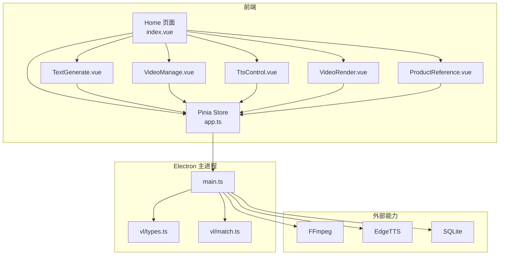
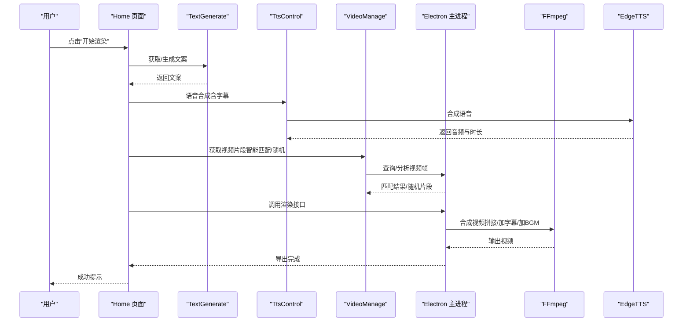
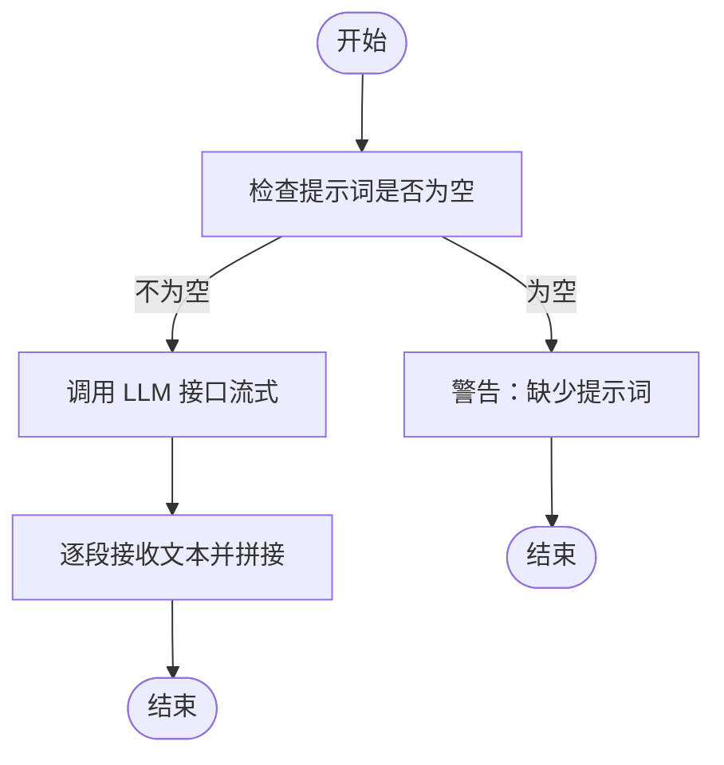
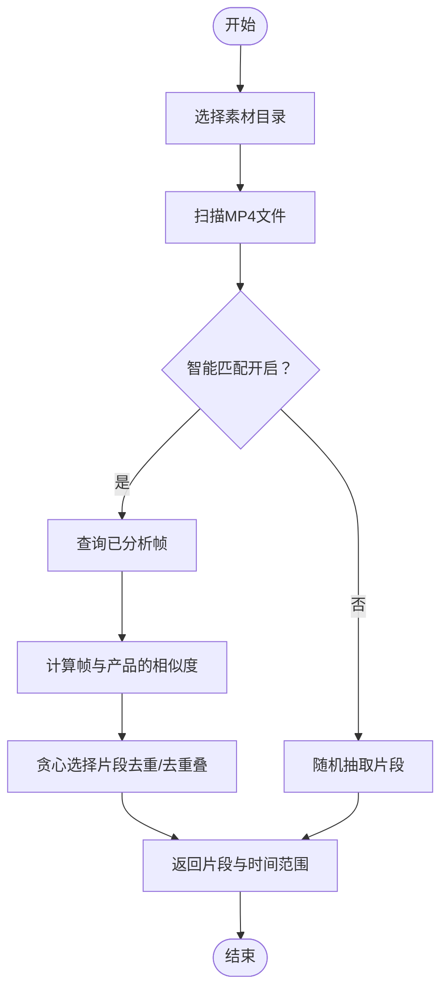
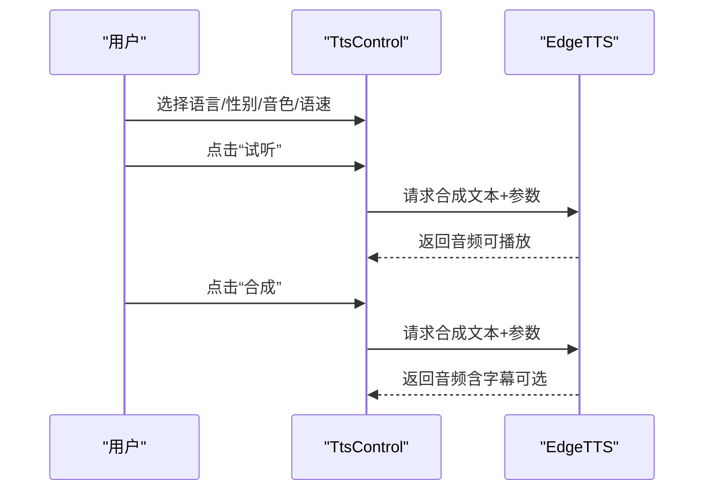
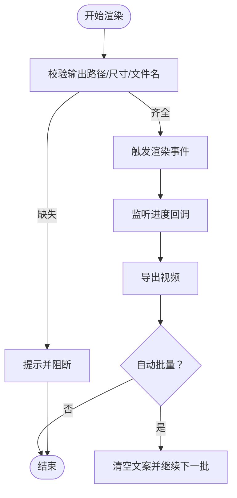
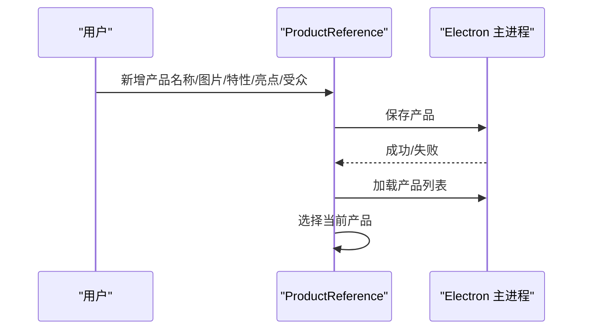
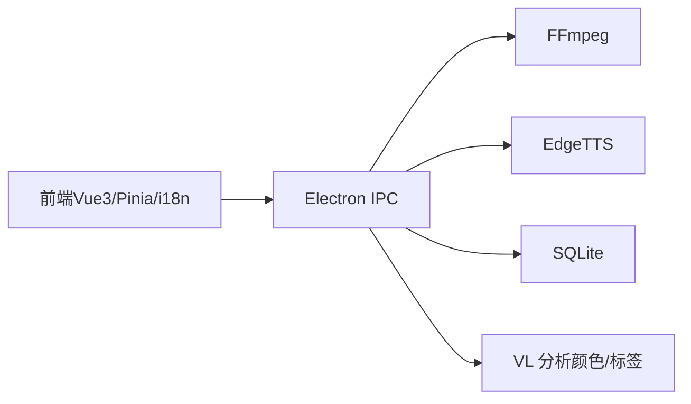

# 应用场景

<cite>
**本文引用的文件**
- [README.md](file://README.md)
- [package.json](file://package.json)
- [src/main.ts](file://src/main.ts)
- [src/views/Home/index.vue](file://src/views/Home/index.vue)
- [src/views/Home/components/TextGenerate.vue](file://src/views/Home/components/TextGenerate.vue)
- [src/views/Home/components/VideoManage.vue](file://src/views/Home/components/VideoManage.vue)
- [src/views/Home/components/TtsControl.vue](file://src/views/Home/components/TtsControl.vue)
- [src/views/Home/components/VideoRender.vue](file://src/views/Home/components/VideoRender.vue)
- [src/views/Home/components/ProductReference.vue](file://src/views/Home/components/ProductReference.vue)
- [src/store/app.ts](file://src/store/app.ts)
- [electron/main.ts](file://electron/main.ts)
- [electron/vl/types.ts](file://electron/vl/types.ts)
- [electron/vl/match.ts](file://electron/vl/match.ts)
</cite>

## 目录
1. [简介](#简介)
2. [项目结构](#项目结构)
3. [核心组件](#核心组件)
4. [架构总览](#架构总览)
5. [详细组件分析](#详细组件分析)
6. [依赖关系分析](#依赖关系分析)
7. [性能考量](#性能考量)
8. [故障排查指南](#故障排查指南)
9. [结论](#结论)
10. [附录](#附录)

## 简介
短视频工厂是一个面向桌面端的 AI 驱动短视频制作工具，支持从“提示词 + 分镜素材”出发，一键生成高质量的产品营销与泛内容短视频。其核心能力包括：
- AI 文案生成：基于提示词与产品上下文生成短视频口播文案
- 语音合成：将文案转为自然语音，支持多语言、音色与语速调节
- 自动剪辑：智能匹配/随机抽取视频片段，自动拼接、配乐与字幕
- 批量处理：支持连续批量合成，提升产出效率
- 多平台与本地化：跨 Windows/macOS/Linux 运行，数据本地化，保障隐私

项目通过 Electron/Vue3 技术栈构建，前端采用 Vuetify 组件库与 Pinia 状态管理，后端 IPC 层对接 FFmpeg、EdgeTTS、SQLite 与视觉分析（VL）能力，形成完整的“提示词→文案→语音→素材→视频”的自动化流水线。

## 项目结构
项目采用“前端 Vue3 + Electron 主进程 + IPC 通信 + SQLite 存储”的分层架构。核心模块划分如下：
- 前端视图层：Home 页面包含文案生成、素材管理、语音控制、渲染配置与产品参考四大区域
- 状态管理层：Pinia Store 统一管理渲染状态、LLM/VL 配置、TTS 语音与渲染参数
- 电子层（Electron）：主进程负责窗口、菜单、国际化与 IPC 初始化；渲染进程通过 window.electron 与主进程交互
- 视觉分析（VL）：对产品与视频帧进行颜色与标签分析，支撑智能选片与素材匹配
- 媒体处理：FFmpeg 负责视频合成、字幕与音轨混合；EdgeTTS 负责语音合成

图表来源
- [src/views/Home/index.vue:1-313](file://src/views/Home/index.vue#L1-L313)
- [src/views/Home/components/TextGenerate.vue:1-272](file://src/views/Home/components/TextGenerate.vue#L1-L272)
- [src/views/Home/components/VideoManage.vue:1-394](file://src/views/Home/components/VideoManage.vue#L1-L394)
- [src/views/Home/components/TtsControl.vue:1-234](file://src/views/Home/components/TtsControl.vue#L1-L234)
- [src/views/Home/components/VideoRender.vue:1-276](file://src/views/Home/components/VideoRender.vue#L1-L276)
- [src/views/Home/components/ProductReference.vue:1-357](file://src/views/Home/components/ProductReference.vue#L1-L357)
- [src/store/app.ts:1-147](file://src/store/app.ts#L1-L147)
- [electron/main.ts:1-204](file://electron/main.ts#L1-L204)
- [electron/vl/types.ts:1-85](file://electron/vl/types.ts#L1-L85)
- [electron/vl/match.ts:1-171](file://electron/vl/match.ts#L1-L171)

章节来源
- [README.md:44-62](file://README.md#L44-L62)
- [src/main.ts:1-62](file://src/main.ts#L1-L62)
- [package.json:1-85](file://package.json#L1-L85)

## 核心组件
- 文案生成（TextGenerate）：支持配置 LLM API（兼容 OpenAI 接口），流式生成短视频口播文案，支持停止生成与配置测试
- 素材管理（VideoManage）：扫描并展示 MP4 分镜素材，支持智能匹配与随机选片；可分析视频帧颜色与标签，辅助选片
- 语音控制（TtsControl）：选择语言/性别/音色，调节语速，试听与合成语音，支持字幕同步
- 渲染配置（VideoRender）：设置输出尺寸、文件名、导出目录、背景音乐目录，开启自动批量；显示渲染进度与状态
- 产品参考（ProductReference）：维护产品画像（名称、图片、特性、亮点、受众、描述、颜色与标签），用于智能选片与文案上下文
- 状态管理（Store）：统一管理渲染状态、LLM/VL 配置、TTS 参数、渲染配置与智能匹配开关

章节来源
- [src/views/Home/components/TextGenerate.vue:128-198](file://src/views/Home/components/TextGenerate.vue#L128-L198)
- [src/views/Home/components/VideoManage.vue:281-386](file://src/views/Home/components/VideoManage.vue#L281-L386)
- [src/views/Home/components/TtsControl.vue:209-228](file://src/views/Home/components/TtsControl.vue#L209-L228)
- [src/views/Home/components/VideoRender.vue:228-266](file://src/views/Home/components/VideoRender.vue#L228-L266)
- [src/views/Home/components/ProductReference.vue:184-240](file://src/views/Home/components/ProductReference.vue#L184-L240)
- [src/store/app.ts:6-14](file://src/store/app.ts#L6-L14)

## 架构总览
短视频工厂的渲染流程由 Home 页面协调，贯穿文案生成、语音合成、素材匹配/随机、视频合成与导出。系统通过 IPC 与 Electron 主进程交互，调用 FFmpeg 进行视频合成，EdgeTTS 进行语音合成，SQLite 存储产品与帧分析结果，VL 模块提供颜色与标签分析能力。

图表来源
- [src/views/Home/index.vue:88-281](file://src/views/Home/index.vue#L88-L281)
- [src/views/Home/components/TextGenerate.vue:128-198](file://src/views/Home/components/TextGenerate.vue#L128-L198)
- [src/views/Home/components/TtsControl.vue:209-228](file://src/views/Home/components/TtsControl.vue#L209-L228)
- [src/views/Home/components/VideoManage.vue:281-386](file://src/views/Home/components/VideoManage.vue#L281-L386)
- [electron/main.ts:1-204](file://electron/main.ts#L1-L204)

## 详细组件分析

### 文案生成（TextGenerate）
- 功能要点
  - 配置 LLM API（模型名、地址、密钥），支持连接测试
  - 流式生成短视频口播文案，支持中断
  - 输出文案供语音合成与渲染使用
- 数据流
  - 输入：用户提示词 + 可选产品上下文
  - 处理：调用 OpenAI 兼容接口，流式拼接文本
  - 输出：当前文案文本
- 错误处理
  - 提示词为空、网络异常、服务端错误均通过 Toast 与可复制错误详情反馈

图表来源
- [src/views/Home/components/TextGenerate.vue:128-198](file://src/views/Home/components/TextGenerate.vue#L128-L198)

章节来源
- [src/views/Home/components/TextGenerate.vue:1-272](file://src/views/Home/components/TextGenerate.vue#L1-L272)

### 素材管理（VideoManage）
- 功能要点
  - 选择素材目录，扫描 MP4 文件并预览
  - 智能匹配：基于产品颜色与标签，从已分析的视频帧中挑选最契合片段
  - 随机选片：按目标时长随机拼接片段，保证总时长覆盖
  - 分析进度：支持 VL 分析统计与进度回调
- 数据流
  - 选择目录 → 列表过滤 → 智能匹配/随机 → 返回片段与时间范围
- 性能与可靠性
  - 对视频时长进行缓存，避免重复解析
  - 最大尝试次数限制，防止无限循环
  - 智能匹配失败时自动回退到随机模式

图表来源
- [src/views/Home/components/VideoManage.vue:281-386](file://src/views/Home/components/VideoManage.vue#L281-L386)
- [electron/vl/match.ts:67-149](file://electron/vl/match.ts#L67-L149)

章节来源
- [src/views/Home/components/VideoManage.vue:1-394](file://src/views/Home/components/VideoManage.vue#L1-L394)
- [electron/vl/match.ts:1-171](file://electron/vl/match.ts#L1-L171)

### 语音控制（TtsControl）
- 功能要点
  - 语言/性别/音色筛选与试听
  - 语速调节（慢/中/快）
  - 合成语音并可选生成带字幕的音频
- 数据流
  - 用户选择 → 校验配置 → 调用 EdgeTTS → 返回音频数据
- 错误处理
  - 语音列表获取失败、试听/合成失败均提供可复制错误详情

图表来源
- [src/views/Home/components/TtsControl.vue:91-138](file://src/views/Home/components/TtsControl.vue#L91-L138)
- [src/views/Home/components/TtsControl.vue:209-228](file://src/views/Home/components/TtsControl.vue#L209-L228)

章节来源
- [src/views/Home/components/TtsControl.vue:1-234](file://src/views/Home/components/TtsControl.vue#L1-L234)

### 渲染配置（VideoRender）
- 功能要点
  - 设置输出尺寸、文件名、导出目录、背景音乐目录
  - 配置 VL 模型（用于智能匹配）
  - 开启自动批量，渲染进度监听
- 数据流
  - 用户点击“开始渲染” → 校验配置 → 触发渲染 → 进度回调 → 导出完成

图表来源
- [src/views/Home/components/VideoRender.vue:228-266](file://src/views/Home/components/VideoRender.vue#L228-L266)
- [src/views/Home/index.vue:88-100](file://src/views/Home/index.vue#L88-L100)

章节来源
- [src/views/Home/components/VideoRender.vue:1-276](file://src/views/Home/components/VideoRender.vue#L1-L276)

### 产品参考（ProductReference）
- 功能要点
  - 新增/编辑产品画像（名称、图片、特性、亮点、受众、描述）
  - 保存产品并可选进行外观分析（颜色与标签）
  - 选择产品作为文案与选片的上下文
- 数据流
  - 保存产品 → 写入数据库 → 加载产品列表 → 选择当前产品

图表来源
- [src/views/Home/components/ProductReference.vue:269-304](file://src/views/Home/components/ProductReference.vue#L269-L304)
- [src/views/Home/components/ProductReference.vue:212-229](file://src/views/Home/components/ProductReference.vue#L212-L229)

章节来源
- [src/views/Home/components/ProductReference.vue:1-357](file://src/views/Home/components/ProductReference.vue#L1-L357)

## 依赖关系分析
- 前端依赖
  - Vue3 + Vite + Vuetify：界面与组件生态
  - Pinia：全局状态管理
  - i18next-vue：国际化
  - ai/@ai-sdk/openai：LLM 文案生成
  - vue-toastification：消息提示
- Electron 依赖
  - ffmpeg-static：视频合成
  - better-sqlite3：本地数据库
  - music-metadata/subtitle：媒体元数据与字幕
  - ws：WebSocket（IPC/通信）
- 运行环境
  - Node >= 22.17.0，pnpm >= 10.12.4

图表来源
- [package.json:22-63](file://package.json#L22-L63)
- [src/main.ts:1-62](file://src/main.ts#L1-L62)
- [electron/main.ts:1-204](file://electron/main.ts#L1-L204)

章节来源
- [package.json:1-85](file://package.json#L1-L85)
- [src/main.ts:1-62](file://src/main.ts#L1-L62)
- [electron/main.ts:1-204](file://electron/main.ts#L1-L204)

## 性能考量
- 智能匹配优先：当启用智能匹配且具备产品颜色/标签时，优先从已分析帧中挑选契合片段，减少人工选片成本
- 随机选片兜底：若智能匹配未找到足够片段，自动回退到随机模式，保证时长覆盖
- 视频时长缓存：对素材时长进行缓存，避免重复解析导致的性能损耗
- 进度与状态：渲染进度通过 IPC 实时反馈，状态机清晰，便于用户感知与中断
- 批量处理：开启自动批量可在完成后自动清理文案并继续下一批，提升吞吐

## 故障排查指南
- 文案生成失败
  - 检查提示词是否为空
  - 检查 LLM API 配置（地址、密钥、模型名）是否正确
  - 使用“连接测试”验证网络连通性
- 语音合成失败
  - 确认已选择音色与试听文本
  - 检查 EdgeTTS 服务可用性与网络
- 素材加载失败
  - 确认素材目录包含 MP4 文件
  - 检查视频元数据读取权限与时长有效性
- 渲染失败
  - 检查输出路径、尺寸与文件名是否配置
  - 查看进度与错误详情，必要时复制错误信息以便定位

章节来源
- [src/views/Home/components/TextGenerate.vue:160-198](file://src/views/Home/components/TextGenerate.vue#L160-L198)
- [src/views/Home/components/TtsControl.vue:112-138](file://src/views/Home/components/TtsControl.vue#L112-L138)
- [src/views/Home/components/VideoManage.vue:156-179](file://src/views/Home/components/VideoManage.vue#L156-L179)
- [src/views/Home/components/VideoRender.vue:224-226](file://src/views/Home/components/VideoRender.vue#L224-L226)

## 结论
短视频工厂通过“提示词→文案→语音→素材→视频”的全链路自动化，显著降低了短视频制作门槛，提升了内容创作者的生产效率。其智能匹配与批量处理能力尤其适合需要高频产出的营销与内容场景。对于个人创作者、企业营销团队与教育机构，均可根据自身需求灵活配置产品画像与素材库，快速生成高质量短视频。

## 附录

### 应用场景与使用建议

- 产品营销短视频制作
  - 场景价值：快速生成多产品、多风格的营销短片，统一品牌调性与节奏
  - 使用流程
    1) 在“产品参考”中新增/选择产品，填写名称、图片、特性、亮点、受众与描述
    2) 准备分镜素材（MP4），在“素材管理”中选择目录并刷新
    3) 在“文案生成”中输入提示词，或使用产品上下文生成文案
    4) 在“语音控制”中选择合适音色与语速，试听并确认
    5) 在“渲染配置”中设置输出尺寸、文件名与导出目录，开启智能匹配与自动批量
    6) 点击“开始渲染”，等待进度完成并导出
  - 效果与质量：通过智能匹配与字幕同步，确保画面与文案高度契合，视觉与听觉体验一致

- 泛内容短视频创作
  - 场景价值：适用于日常口播、知识分享、生活记录等泛内容场景
  - 使用建议
    - 提示词应明确主题与时长要求（如“15-30秒”）
    - 素材尽量丰富，覆盖不同角度与节奏
    - 语音语速可根据内容节奏调整（快/中/慢）

- 教育培训视频
  - 场景价值：将知识点转化为短视频，便于传播与复用
  - 使用建议
    - 产品画像可包含课程名称、教学目标、适用人群
    - 素材建议使用讲解、演示、板书等多类片段
    - 语音语速适中，配合字幕增强理解

- 批量处理多个产品视频
  - 启用“自动批量”，在渲染完成后自动清理文案并继续下一批
  - 通过产品参考集中管理多产品画像，减少重复配置
  - 智能匹配优先，确保每个产品的视频风格一致

- 不同用户群体的针对性建议
  - 个人创作者：从简单提示词入手，逐步完善产品画像与素材库；利用智能匹配提升选片效率
  - 企业营销团队：建立标准化产品画像模板与素材库；批量处理提升产出速度；统一语音与字幕风格
  - 教育机构：将课程内容结构化为产品画像；通过字幕与语音同步提升学习体验

章节来源
- [src/views/Home/index.vue:68-82](file://src/views/Home/index.vue#L68-L82)
- [src/views/Home/components/VideoManage.vue:189-230](file://src/views/Home/components/VideoManage.vue#L189-L230)
- [src/views/Home/components/VideoRender.vue:183-191](file://src/views/Home/components/VideoRender.vue#L183-L191)