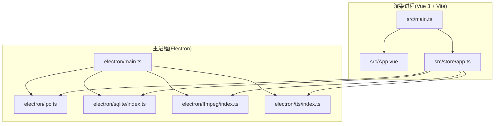
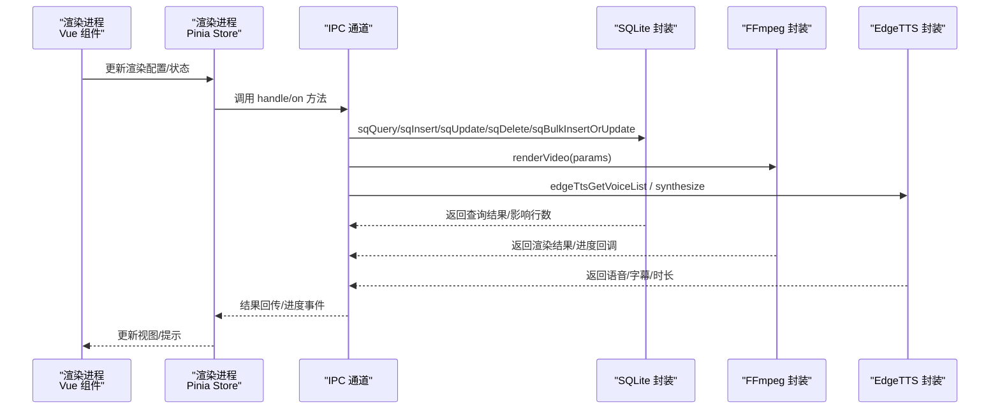
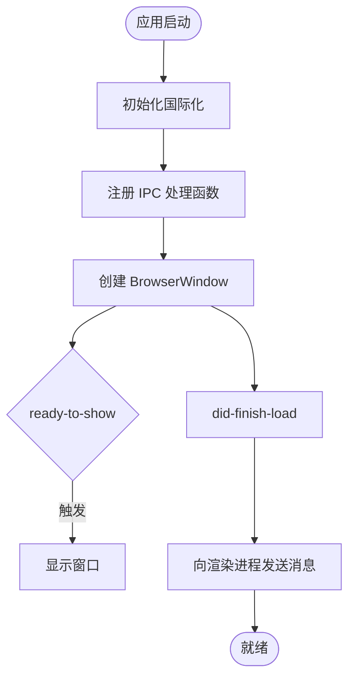
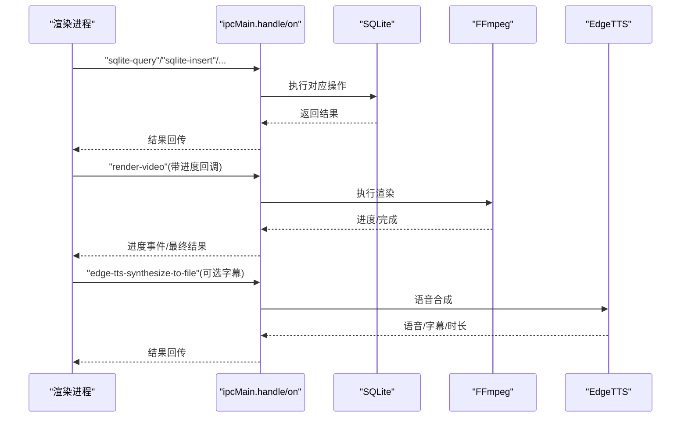
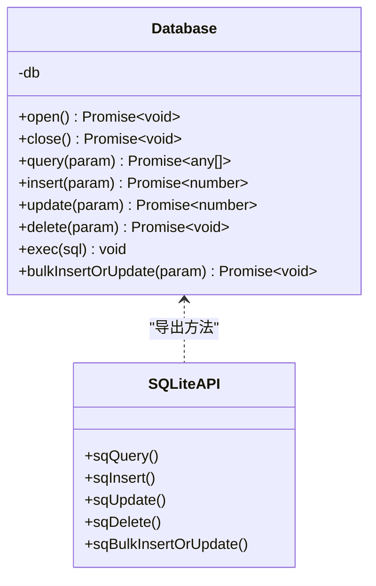
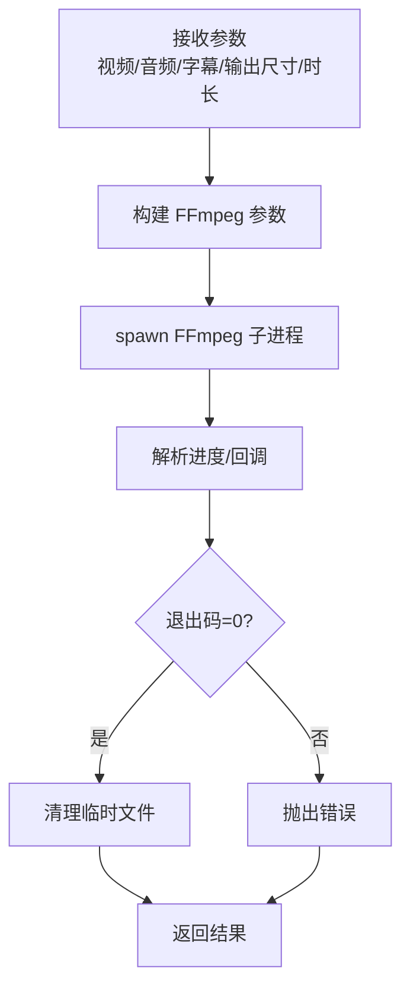
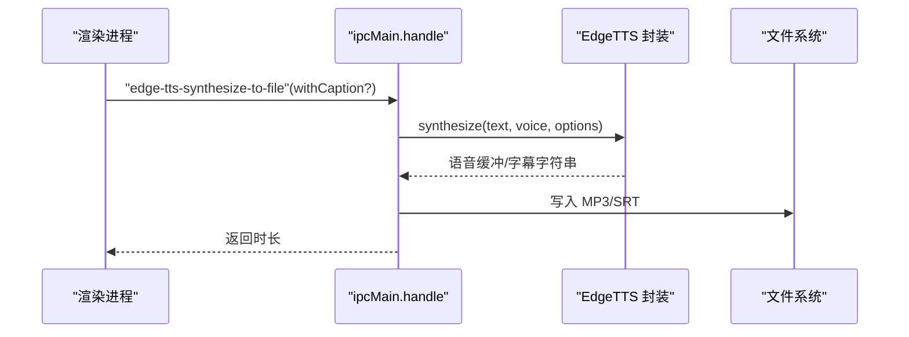
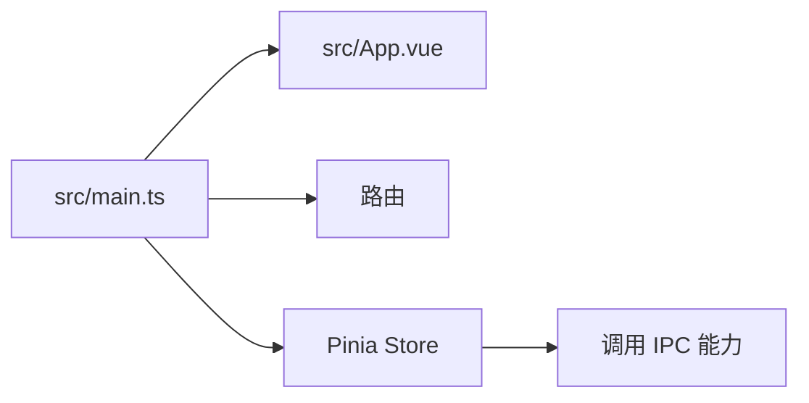
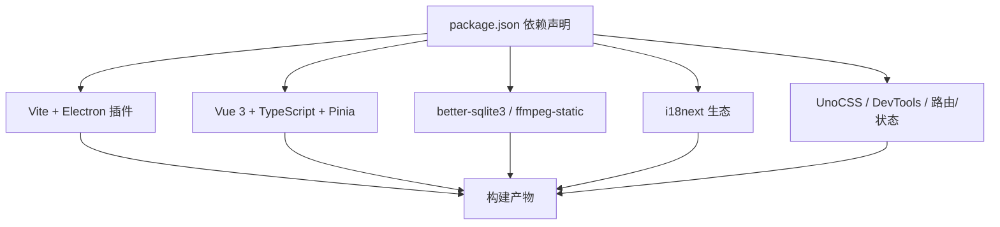

# 技术栈

<cite>
**本文引用的文件**
- [package.json](file://package.json)
- [vite.config.ts](file://vite.config.ts)
- [tsconfig.json](file://tsconfig.json)
- [electron/main.ts](file://electron/main.ts)
- [electron/ipc.ts](file://electron/ipc.ts)
- [electron/sqlite/index.ts](file://electron/sqlite/index.ts)
- [electron/sqlite/types.ts](file://electron/sqlite/types.ts)
- [electron/ffmpeg/index.ts](file://electron/ffmpeg/index.ts)
- [electron/ffmpeg/types.ts](file://electron/ffmpeg/types.ts)
- [electron/tts/index.ts](file://electron/tts/index.ts)
- [electron/tts/types.ts](file://electron/tts/types.ts)
- [src/main.ts](file://src/main.ts)
- [src/App.vue](file://src/App.vue)
- [src/store/app.ts](file://src/store/app.ts)
</cite>

## 目录
1. [简介](#简介)
2. [项目结构](#项目结构)
3. [核心组件](#核心组件)
4. [架构总览](#架构总览)
5. [详细组件分析](#详细组件分析)
6. [依赖分析](#依赖分析)
7. [性能考量](#性能考量)
8. [故障排查指南](#故障排查指南)
9. [结论](#结论)

## 简介
本项目采用“Electron + Vue 3 + TypeScript + Vite”的现代桌面应用技术栈，结合原生能力与现代化前端工程化工具链，实现跨平台桌面应用开发。技术选型兼顾开发效率、运行性能与可维护性：
- Electron 22.3.27：提供跨平台桌面应用运行时与系统级能力（文件系统、子进程、对话框等）。
- Vue 3.5.17 + Vite 7.0.3：提供响应式 UI 与快速热更新、按需构建能力。
- TypeScript 5.6.2：提供类型安全与更好的 IDE 支持。
- 辅助库：better-sqlite3（本地数据库）、FFmpeg（视频渲染）、EdgeTTS（语音合成）等。

## 项目结构
项目采用“主进程 + 渲染进程 + 原生能力封装”的三层结构：
- 主进程（Electron）：负责窗口生命周期、系统菜单、IPC 通信、原生能力初始化（SQLite、FFmpeg、TTS）。
- 渲染进程（Vue 3 + Vite）：负责 UI 展示、路由、状态管理、调用 IPC 与原生能力。
- 原生能力封装：SQLite、FFmpeg、EdgeTTS 的统一接口与类型约束。

图表来源
- [electron/main.ts:1-204](file://electron/main.ts#L1-L204)
- [electron/ipc.ts:1-188](file://electron/ipc.ts#L1-L188)
- [electron/sqlite/index.ts:1-194](file://electron/sqlite/index.ts#L1-L194)
- [electron/ffmpeg/index.ts:1-272](file://electron/ffmpeg/index.ts#L1-L272)
- [electron/tts/index.ts:1-86](file://electron/tts/index.ts#L1-L86)
- [src/main.ts:1-62](file://src/main.ts#L1-L62)
- [src/App.vue:1-12](file://src/App.vue#L1-L12)
- [src/store/app.ts:1-114](file://src/store/app.ts#L1-L114)

章节来源
- [package.json:1-85](file://package.json#L1-L85)
- [vite.config.ts:1-53](file://vite.config.ts#L1-L53)
- [tsconfig.json:1-32](file://tsconfig.json#L1-L32)
- [electron/main.ts:1-204](file://electron/main.ts#L1-L204)
- [src/main.ts:1-62](file://src/main.ts#L1-L62)

## 核心组件
- 主进程入口与窗口管理：负责创建窗口、构建菜单、初始化国际化与 SQLite、注册 IPC 处理函数。
- IPC 通信层：集中暴露 SQLite、文件夹选择、渲染视频、语音合成等能力给渲染进程。
- 数据持久化：基于 better-sqlite3 的本地数据库封装，提供查询、插入、更新、删除与批量写入。
- 视频渲染：基于 FFmpeg 的复杂滤镜管线，支持多片段裁剪、尺寸缩放、字幕叠加、音量归一与混音。
- 语音合成：基于 EdgeTTS 的语音合成与字幕生成，支持 Base64 输出与文件落盘。
- 渲染进程：Vue 3 应用，使用 Vuetify、Pinia、路由与国际化插件，通过 Store 管理渲染状态与配置。

章节来源
- [electron/main.ts:1-204](file://electron/main.ts#L1-L204)
- [electron/ipc.ts:1-188](file://electron/ipc.ts#L1-L188)
- [electron/sqlite/index.ts:1-194](file://electron/sqlite/index.ts#L1-L194)
- [electron/ffmpeg/index.ts:1-272](file://electron/ffmpeg/index.ts#L1-L272)
- [electron/tts/index.ts:1-86](file://electron/tts/index.ts#L1-L86)
- [src/main.ts:1-62](file://src/main.ts#L1-L62)
- [src/store/app.ts:1-114](file://src/store/app.ts#L1-L114)

## 架构总览
下图展示了从渲染进程发起请求到主进程调用原生能力的典型流程，以及数据在各层之间的流转关系。

图表来源
- [electron/ipc.ts:77-187](file://electron/ipc.ts#L77-L187)
- [electron/sqlite/index.ts:63-139](file://electron/sqlite/index.ts#L63-L139)
- [electron/ffmpeg/index.ts:26-186](file://electron/ffmpeg/index.ts#L26-L186)
- [electron/tts/index.ts:35-85](file://electron/tts/index.ts#L35-L85)
- [src/store/app.ts:15-113](file://src/store/app.ts#L15-L113)

## 详细组件分析

### Electron 主进程与窗口生命周期
- 负责创建无边框窗口、注入预加载脚本、监听 ready-to-show 与 did-finish-load 事件。
- 初始化国际化、SQLite、IPC，并构建应用菜单（含语言切换）。
- 注册命令行开关以禁用 CORS 与允许本地网络请求，便于跨域与本地资源访问。

图表来源
- [electron/main.ts:187-203](file://electron/main.ts#L187-L203)
- [electron/main.ts:40-76](file://electron/main.ts#L40-L76)

章节来源
- [electron/main.ts:1-204](file://electron/main.ts#L1-L204)

### IPC 通信与能力暴露
- 暴露 SQLite 能力：查询、插入、更新、删除、批量插入或更新。
- 文件系统与对话框：选择文件夹、列出文件夹内文件、打开外部链接。
- 窗口控制：最小化、最大化/还原、关闭。
- 统计事件上报、渲染视频、语音合成（含字幕生成与时长计算）。

图表来源
- [electron/ipc.ts:77-187](file://electron/ipc.ts#L77-L187)
- [electron/sqlite/index.ts:63-139](file://electron/sqlite/index.ts#L63-L139)
- [electron/ffmpeg/index.ts:26-186](file://electron/ffmpeg/index.ts#L26-L186)
- [electron/tts/index.ts:39-85](file://electron/tts/index.ts#L39-L85)

章节来源
- [electron/ipc.ts:1-188](file://electron/ipc.ts#L1-L188)

### SQLite 封装与数据模型
- 使用 better-sqlite3 并根据平台/架构选择对应的原生绑定文件。
- 默认数据库位于 userData 目录下的 data.db。
- 提供基础 CRUD 与批量写入（ON CONFLICT DO UPDATE）。
- 初始化阶段创建产品参考表与素材帧分析表，并建立索引以优化查询。

图表来源
- [electron/sqlite/index.ts:38-140](file://electron/sqlite/index.ts#L38-L140)
- [electron/sqlite/types.ts:1-26](file://electron/sqlite/types.ts#L1-L26)

章节来源
- [electron/sqlite/index.ts:1-194](file://electron/sqlite/index.ts#L1-L194)
- [electron/sqlite/types.ts:1-26](file://electron/sqlite/types.ts#L1-L26)

### FFmpeg 视频渲染管线
- 支持多视频输入裁剪、缩放到目标分辨率、拼接、重采样、字幕叠加。
- 音频处理包含响度归一（loudnorm）、时长修剪与混合（amix），保证音量一致性。
- 通过子进程执行 FFmpeg，解析进度并支持取消（AbortSignal）。
- 自动清理临时语音与字幕文件。

图表来源
- [electron/ffmpeg/index.ts:26-186](file://electron/ffmpeg/index.ts#L26-L186)
- [electron/ffmpeg/types.ts:7-22](file://electron/ffmpeg/types.ts#L7-L22)

章节来源
- [electron/ffmpeg/index.ts:1-272](file://electron/ffmpeg/index.ts#L1-L272)
- [electron/ffmpeg/types.ts:1-23](file://electron/ffmpeg/types.ts#L1-L23)

### EdgeTTS 语音合成与字幕生成
- 提供语音列表查询、文本转语音（Base64/文件）、字幕生成（SRT）。
- 自动解析 MP3 时长，确保渲染前音频有效性。
- 应用退出前清理临时语音与字幕文件。

图表来源
- [electron/tts/index.ts:39-85](file://electron/tts/index.ts#L39-L85)
- [electron/tts/types.ts:3-19](file://electron/tts/types.ts#L3-L19)

章节来源
- [electron/tts/index.ts:1-86](file://electron/tts/index.ts#L1-L86)
- [electron/tts/types.ts:1-20](file://electron/tts/types.ts#L1-L20)

### 渲染进程：Vue 3 + Vite + Pinia
- 应用入口初始化 Vuetify、Toast、路由、Pinia、国际化。
- 通过 Store 管理渲染状态、配置与 TTS 语音列表等。
- 与主进程通过 IPC 交互，实现文件选择、渲染控制、统计上报等功能。

图表来源
- [src/main.ts:14-61](file://src/main.ts#L14-L61)
- [src/App.vue:1-12](file://src/App.vue#L1-L12)
- [src/store/app.ts:15-113](file://src/store/app.ts#L15-L113)

章节来源
- [src/main.ts:1-62](file://src/main.ts#L1-L62)
- [src/App.vue:1-12](file://src/App.vue#L1-L12)
- [src/store/app.ts:1-114](file://src/store/app.ts#L1-L114)

## 依赖分析
- 构建与打包：Vite 7.0.3 + electron-vite 插件，支持主进程与渲染进程一体化开发；Electron Builder 用于打包。
- 类型与工具：TypeScript 5.6.2、Vue 3.5.17、Vue Router、Pinia、UnoCSS/Vite 插件、Vue DevTools。
- 原生能力：better-sqlite3、ffmpeg-static、i18next 生态、WebSocket 客户端等。
- 平台与版本：Node >= 22.17.0，pnpm >= 10.12.4；Electron 22.3.27。

图表来源
- [package.json:22-63](file://package.json#L22-L63)
- [vite.config.ts:10-41](file://vite.config.ts#L10-L41)
- [tsconfig.json:2-24](file://tsconfig.json#L2-L24)

章节来源
- [package.json:1-85](file://package.json#L1-L85)
- [vite.config.ts:1-53](file://vite.config.ts#L1-L53)
- [tsconfig.json:1-32](file://tsconfig.json#L1-L32)

## 性能考量
- Vite 快速冷启动与热更新：开发期显著缩短等待时间，提升迭代效率。
- Electron 主进程与渲染进程分离：避免 UI 卡顿，提高稳定性。
- FFmpeg 进度回调与取消机制：在长任务中提供可控的用户体验。
- SQLite 事务与批量写入：减少多次往返，提升写入吞吐。
- UnoCSS 按需样式：减小包体与运行时开销。

## 故障排查指南
- FFmpeg 可执行权限问题（Windows）：封装内置校验逻辑，若缺失可检查打包后路径与权限。
- 语音合成时长异常：确认网络连通与 TTS 配置，音频时长通过元数据解析，异常会抛出明确错误。
- SQLite 原生绑定不匹配：根据平台/架构选择正确的 .node 文件，确保 Electron 版本与 better-sqlite3 版本兼容。
- IPC 调用失败：检查主进程是否已注册对应 handle/on，渲染进程调用是否传入正确参数。
- 跨域与本地网络请求：主进程已禁用 CORS 与私有网络限制，若仍失败，检查具体请求头与目标地址。

章节来源
- [electron/ffmpeg/index.ts:246-259](file://electron/ffmpeg/index.ts#L246-L259)
- [electron/tts/index.ts:70-81](file://electron/tts/index.ts#L70-L81)
- [electron/sqlite/index.ts:19-36](file://electron/sqlite/index.ts#L19-L36)
- [electron/ipc.ts:1-188](file://electron/ipc.ts#L1-L188)
- [electron/main.ts:197-202](file://electron/main.ts#L197-L202)

## 结论
本项目通过 Electron + Vue 3 + TypeScript + Vite 的组合，实现了高性能、可维护的跨平台桌面应用。主进程负责系统能力与原生封装，渲染进程专注 UI 与业务逻辑，IPC 作为桥梁串联两端。SQLite、FFmpeg、EdgeTTS 等关键能力均以清晰的接口与类型约束呈现，便于扩展与维护。建议在后续开发中持续关注 Electron/Vite/TypeScript 的版本演进，结合项目实际场景优化构建策略与运行时性能。