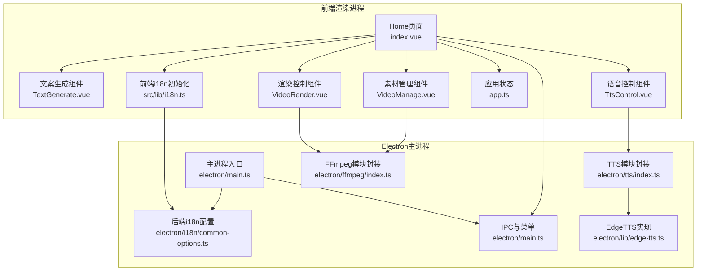
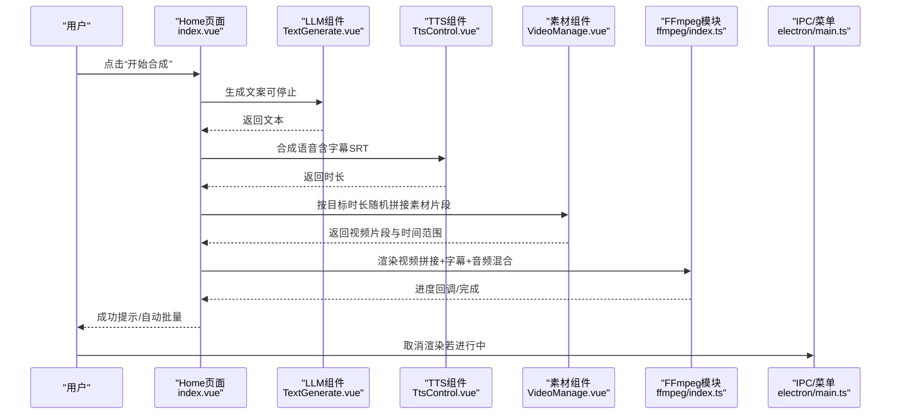
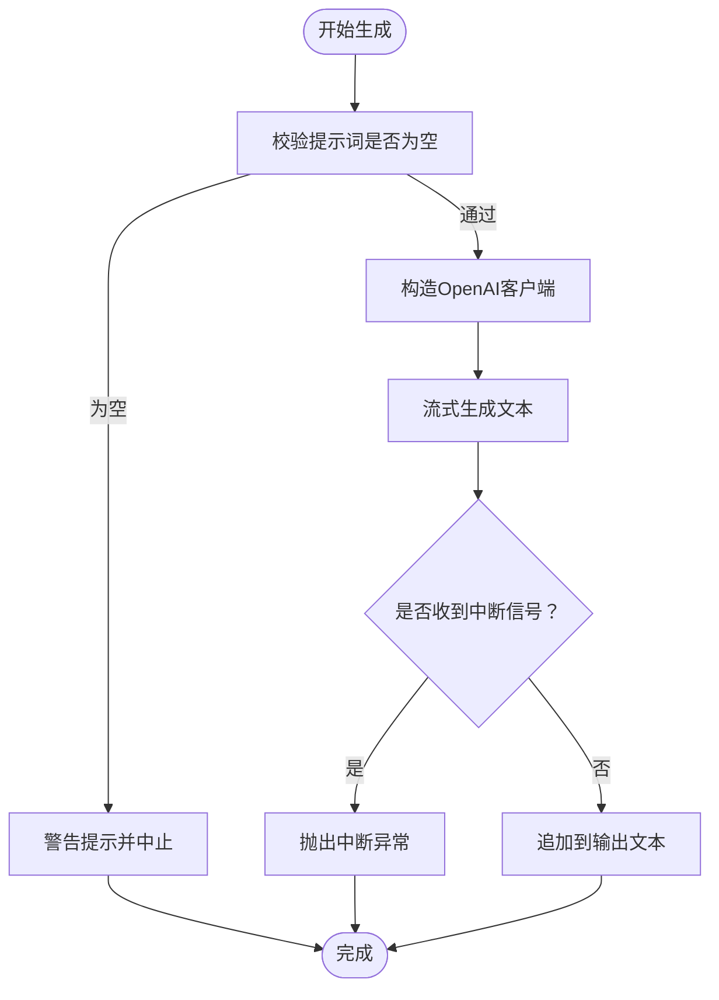
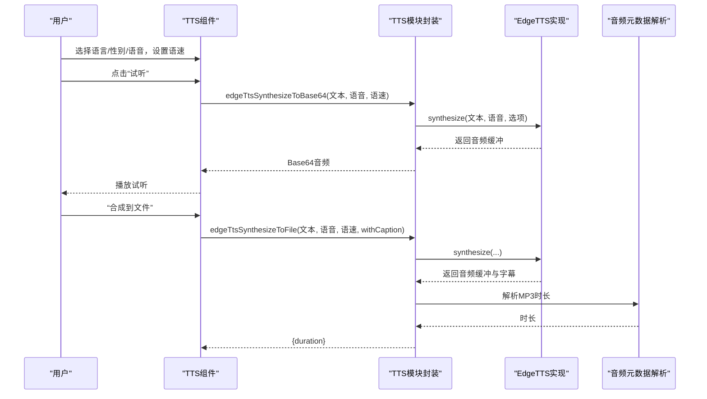
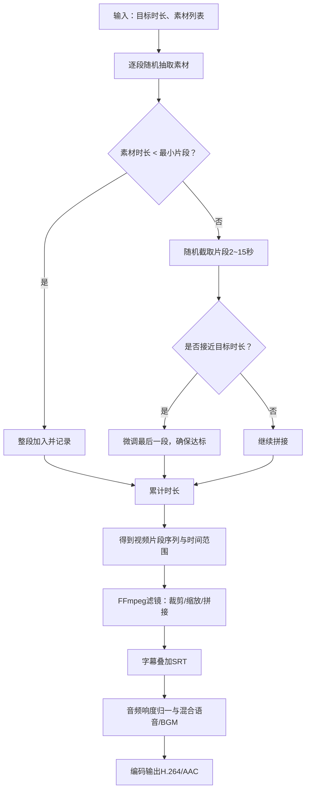
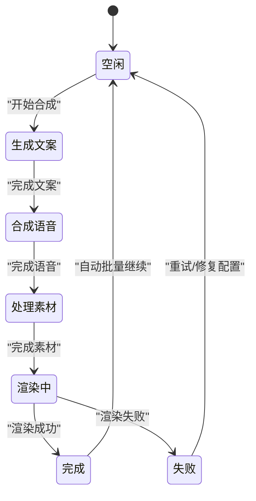
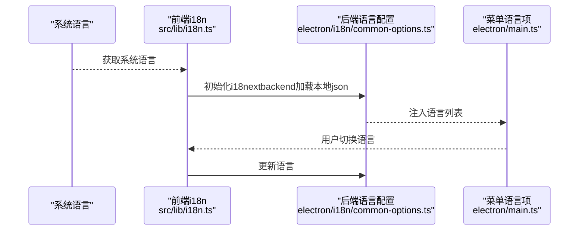
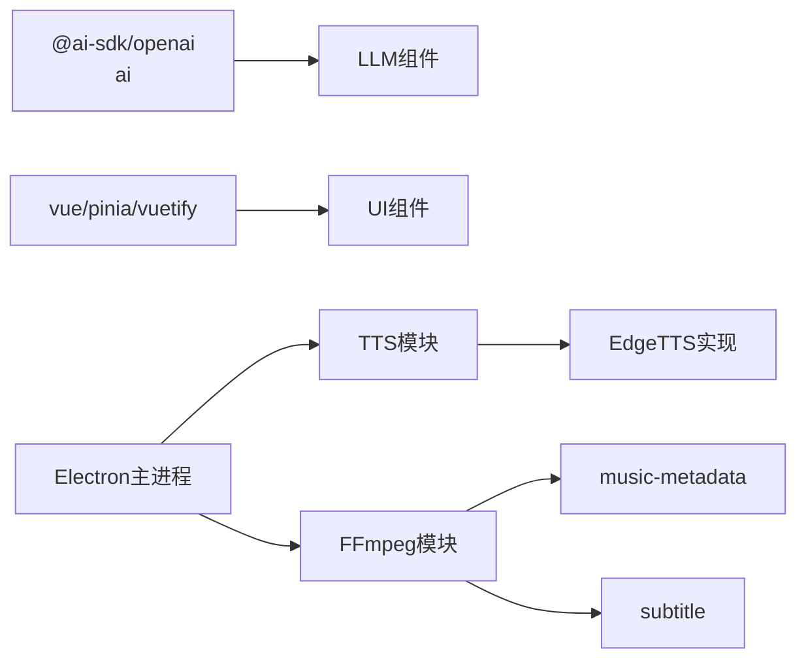

# 核心功能

<cite>
**本文引用的文件**
- [README.md](file://README.md)
- [package.json](file://package.json)
- [src/views/Home/index.vue](file://src/views/Home/index.vue)
- [src/views/Home/components/TextGenerate.vue](file://src/views/Home/components/TextGenerate.vue)
- [src/views/Home/components/TtsControl.vue](file://src/views/Home/components/TtsControl.vue)
- [src/views/Home/components/VideoManage.vue](file://src/views/Home/components/VideoManage.vue)
- [src/views/Home/components/VideoRender.vue](file://src/views/Home/components/VideoRender.vue)
- [src/store/app.ts](file://src/store/app.ts)
- [src/lib/i18n.ts](file://src/lib/i18n.ts)
- [electron/main.ts](file://electron/main.ts)
- [electron/tts/index.ts](file://electron/tts/index.ts)
- [electron/ffmpeg/index.ts](file://electron/ffmpeg/index.ts)
- [electron/lib/edge-tts.ts](file://electron/lib/edge-tts.ts)
- [electron/i18n/common-options.ts](file://electron/i18n/common-options.ts)
- [locales/en/common.json](file://locales/en/common.json)
- [locales/zh-CN/common.json](file://locales/zh-CN/common.json)
</cite>

## 目录
1. [简介](#简介)
2. [项目结构](#项目结构)
3. [核心组件](#核心组件)
4. [架构总览](#架构总览)
5. [详细组件分析](#详细组件分析)
6. [依赖关系分析](#依赖关系分析)
7. [性能考量](#性能考量)
8. [故障排查指南](#故障排查指南)
9. [结论](#结论)
10. [附录](#附录)

## 简介
短视频工厂是一个面向桌面端的AI驱动短视频制作工具，提供从“提示词+分镜素材”到“自动批量剪辑”的完整工作流。其核心能力包括：
- 基于提示词的智能文案生成（兼容OpenAI标准接口）
- EdgeTTS语音合成与试听预览
- 自动视频剪辑：视频素材拼接、字幕生成与音频混合
- 批量处理与多语言支持

这些能力共同构成“开箱即用”的短视频生产流水线，帮助用户高效产出高质量的营销与泛内容视频。

章节来源
- [README.md:44-62](file://README.md#L44-L62)

## 项目结构
项目采用Electron + Vue 3 + Vite的双端架构：
- Electron主进程负责系统级能力（国际化、菜单、IPC、FFmpeg调用、TTS合成）
- 前端渲染进程负责UI交互、状态管理与业务流程编排
- 存储层使用Pinia，配合持久化插件保存用户配置
- 国际化由i18next与Electron侧i18n配置协同完成

图表来源
- [src/views/Home/index.vue:1-244](file://src/views/Home/index.vue#L1-L244)
- [src/views/Home/components/TextGenerate.vue:1-272](file://src/views/Home/components/TextGenerate.vue#L1-L272)
- [src/views/Home/components/TtsControl.vue:1-234](file://src/views/Home/components/TtsControl.vue#L1-L234)
- [src/views/Home/components/VideoManage.vue:1-308](file://src/views/Home/components/VideoManage.vue#L1-L308)
- [src/views/Home/components/VideoRender.vue:1-246](file://src/views/Home/components/VideoRender.vue#L1-L246)
- [src/store/app.ts:1-114](file://src/store/app.ts#L1-L114)
- [src/lib/i18n.ts:1-28](file://src/lib/i18n.ts#L1-L28)
- [electron/main.ts:1-204](file://electron/main.ts#L1-L204)
- [electron/i18n/common-options.ts:1-16](file://electron/i18n/common-options.ts#L1-L16)
- [electron/tts/index.ts:1-86](file://electron/tts/index.ts#L1-L86)
- [electron/ffmpeg/index.ts:1-272](file://electron/ffmpeg/index.ts#L1-L272)
- [electron/lib/edge-tts.ts:1-632](file://electron/lib/edge-tts.ts#L1-L632)

章节来源
- [package.json:1-85](file://package.json#L1-L85)
- [electron/main.ts:187-204](file://electron/main.ts#L187-L204)

## 核心组件
- 文案生成（LLM）
  - 基于@ai-sdk/openai与ai库，支持流式生成与停止
  - 支持测试配置连通性、保存配置
- 语音合成（EdgeTTS）
  - 支持语言/性别筛选、语音列表拉取、语速调节
  - 支持试听播放与文件合成，生成字幕SRT
- 素材管理与自动剪辑
  - 分镜素材选择与刷新，按目标时长随机拼接片段
  - FFmpeg复杂滤镜：裁剪、缩放、拼接、响度归一、字幕叠加、音频混合
- 渲染控制与批量
  - 渲染状态机、进度反馈、取消渲染
  - 自动批量：完成后自动开始下一批次
- 多语言支持
  - 前端i18n初始化与后端语言菜单联动

章节来源
- [src/views/Home/components/TextGenerate.vue:128-198](file://src/views/Home/components/TextGenerate.vue#L128-L198)
- [src/views/Home/components/TtsControl.vue:75-138](file://src/views/Home/components/TtsControl.vue#L75-L138)
- [src/views/Home/components/VideoManage.vue:195-300](file://src/views/Home/components/VideoManage.vue#L195-L300)
- [src/views/Home/components/VideoRender.vue:188-240](file://src/views/Home/components/VideoRender.vue#L188-L240)
- [src/store/app.ts:5-13](file://src/store/app.ts#L5-L13)

## 架构总览
整体流程：用户在Home页面依次完成“提示词生成文案”、“选择分镜素材”、“语音合成与试听”、“开始渲染”，渲染过程由FFmpeg完成视频拼接、字幕叠加与音频混合，并支持进度回调与取消。

图表来源
- [src/views/Home/index.vue:65-212](file://src/views/Home/index.vue#L65-L212)
- [src/views/Home/components/TextGenerate.vue:132-198](file://src/views/Home/components/TextGenerate.vue#L132-L198)
- [src/views/Home/components/TtsControl.vue:209-228](file://src/views/Home/components/TtsControl.vue#L209-L228)
- [src/views/Home/components/VideoManage.vue:195-300](file://src/views/Home/components/VideoManage.vue#L195-L300)
- [electron/ffmpeg/index.ts:26-186](file://electron/ffmpeg/index.ts#L26-L186)
- [electron/main.ts:187-204](file://electron/main.ts#L187-L204)

## 详细组件分析

### AI驱动的文案生成系统
- 功能要点
  - 提示词输入与文案输出，支持清空与获取当前输出
  - 测试配置连通性（Hello测试）、保存配置
  - 流式生成与中断（AbortController）
- 使用场景
  - 快速生成产品卖点、情感语录、知识讲解等短视频脚本文案
  - 与LLM接口兼容（OpenAI标准），便于替换或扩展
- 操作示例
  - 在“提示词”框输入主题，点击“生成”；如需停止，点击“停止”
  - 点击“配置”填写模型名、API地址、API Key，点击“测试”验证连通性

图表来源
- [src/views/Home/components/TextGenerate.vue:132-198](file://src/views/Home/components/TextGenerate.vue#L132-L198)

章节来源
- [src/views/Home/components/TextGenerate.vue:128-255](file://src/views/Home/components/TextGenerate.vue#L128-L255)
- [locales/en/common.json:78-96](file://locales/en/common.json#L78-L96)
- [locales/zh-CN/common.json:78-96](file://locales/zh-CN/common.json#L78-L96)

### 语音合成（EdgeTTS）与试听预览
- 功能要点
  - 语言/性别筛选，动态过滤可用语音
  - 试听播放：将合成音频以Base64转为Audio对象播放
  - 文件合成：写入MP3与对应SRT字幕，解析时长
- 参数调节
  - 语速（慢/中/快）、试听文本、目标语音
- 使用场景
  - 为生成的文案配音，快速试听不同声音与语速
  - 导出带字幕的语音文件，供后续视频渲染使用

图表来源
- [src/views/Home/components/TtsControl.vue:75-138](file://src/views/Home/components/TtsControl.vue#L75-L138)
- [src/views/Home/components/TtsControl.vue:209-228](file://src/views/Home/components/TtsControl.vue#L209-L228)
- [electron/tts/index.ts:39-85](file://electron/tts/index.ts#L39-L85)
- [electron/lib/edge-tts.ts:477-504](file://electron/lib/edge-tts.ts#L477-L504)

章节来源
- [src/views/Home/components/TtsControl.vue:1-234](file://src/views/Home/components/TtsControl.vue#L1-L234)
- [electron/tts/index.ts:1-86](file://electron/tts/index.ts#L1-L86)
- [electron/lib/edge-tts.ts:1-632](file://electron/lib/edge-tts.ts#L1-L632)
- [locales/en/common.json:97-125](file://locales/en/common.json#L97-L125)
- [locales/zh-CN/common.json:97-125](file://locales/zh-CN/common.json#L97-L125)

### 自动视频剪辑与字幕特效
- 功能要点
  - 分镜素材选择与刷新，过滤MP4
  - 按目标时长随机拼接片段，限制每段2–15秒
  - FFmpeg复杂滤镜链：裁剪、缩放至目标分辨率、拼接、重采样、字幕叠加、音频响度归一与混合
- 字幕特效
  - 基于EdgeTTS提供的词边界信息生成SRT字幕
- 使用场景
  - 将文案与语音时长匹配，自动拼接分镜素材，生成成品视频
  - 一键导出带字幕与背景音乐的视频

图表来源
- [src/views/Home/components/VideoManage.vue:195-300](file://src/views/Home/components/VideoManage.vue#L195-L300)
- [electron/ffmpeg/index.ts:56-186](file://electron/ffmpeg/index.ts#L56-L186)
- [electron/lib/edge-tts.ts:361-417](file://electron/lib/edge-tts.ts#L361-L417)

章节来源
- [src/views/Home/components/VideoManage.vue:1-308](file://src/views/Home/components/VideoManage.vue#L1-L308)
- [electron/ffmpeg/index.ts:1-272](file://electron/ffmpeg/index.ts#L1-L272)
- [locales/en/common.json:126-138](file://locales/en/common.json#L126-L138)
- [locales/zh-CN/common.json:126-138](file://locales/zh-CN/common.json#L126-L138)

### 批量处理与工作流编排
- 功能要点
  - 渲染状态机：生成文案、合成语音、处理素材、渲染中、完成/失败
  - 渲染进度：通过IPC接收FFmpeg进度事件
  - 自动批量：开启后渲染完成后自动清理并开始下一批
  - 取消渲染：在渲染中阶段通过IPC发送取消信号
- 使用场景
  - 一键生成多个短视频，无需人工干预
  - 快速迭代文案与素材，提高产出效率

图表来源
- [src/store/app.ts:5-13](file://src/store/app.ts#L5-L13)
- [src/views/Home/index.vue:65-212](file://src/views/Home/index.vue#L65-L212)
- [src/views/Home/components/VideoRender.vue:188-240](file://src/views/Home/components/VideoRender.vue#L188-L240)

章节来源
- [src/views/Home/index.vue:61-238](file://src/views/Home/index.vue#L61-L238)
- [src/views/Home/components/VideoRender.vue:1-246](file://src/views/Home/components/VideoRender.vue#L1-L246)
- [src/store/app.ts:72-106](file://src/store/app.ts#L72-L106)

### 多语言支持
- 功能要点
  - Electron主进程维护语言列表与菜单项
  - 前端i18n根据系统语言或用户选择加载对应语言包
  - 支持中文与英文
- 使用场景
  - 不同地区用户使用母语界面，降低理解成本

图表来源
- [src/lib/i18n.ts:7-23](file://src/lib/i18n.ts#L7-L23)
- [electron/i18n/common-options.ts:3-16](file://electron/i18n/common-options.ts#L3-L16)
- [electron/main.ts:107-115](file://electron/main.ts#L107-L115)
- [locales/en/common.json:1-178](file://locales/en/common.json#L1-L178)
- [locales/zh-CN/common.json:1-178](file://locales/zh-CN/common.json#L1-L178)

章节来源
- [src/lib/i18n.ts:1-28](file://src/lib/i18n.ts#L1-L28)
- [electron/i18n/common-options.ts:1-16](file://electron/i18n/common-options.ts#L1-L16)
- [electron/main.ts:78-164](file://electron/main.ts#L78-L164)

## 依赖关系分析
- 前端依赖
  - @ai-sdk/openai、ai：LLM接口与流式生成
  - vue、vite、vuetify：UI框架与构建
  - pinia：全局状态管理
  - i18next-vue：前端国际化
- Electron依赖
  - axios、ws：网络与WebSocket通信
  - ffmpeg-static：FFmpeg二进制
  - music-metadata：音频元数据解析
  - subtitle：SRT字幕生成
  - better-sqlite3：SQLite数据库（未在本文展开）

图表来源
- [package.json:22-63](file://package.json#L22-L63)
- [src/views/Home/components/TextGenerate.vue:113-115](file://src/views/Home/components/TextGenerate.vue#L113-L115)
- [electron/ffmpeg/index.ts:1-272](file://electron/ffmpeg/index.ts#L1-L272)
- [electron/tts/index.ts:1-86](file://electron/tts/index.ts#L1-L86)
- [electron/lib/edge-tts.ts:1-632](file://electron/lib/edge-tts.ts#L1-L632)

章节来源
- [package.json:1-85](file://package.json#L1-L85)

## 性能考量
- 文案生成
  - 使用流式生成减少等待时间；中断机制避免长时间占用
- 语音合成
  - 试听采用Base64即时播放，避免磁盘IO；文件合成后解析MP3时长，确保后续渲染精度
- 素材拼接
  - 随机片段策略与缓存元数据，避免重复读取；滤镜链一次性计算，减少多次编解码
- 渲染进度
  - FFmpeg通过标准错误解析进度，实时反馈；支持取消信号中断

章节来源
- [src/views/Home/components/TextGenerate.vue:146-159](file://src/views/Home/components/TextGenerate.vue#L146-L159)
- [src/views/Home/components/TtsControl.vue:100-111](file://src/views/Home/components/TtsControl.vue#L100-L111)
- [src/views/Home/components/VideoManage.vue:146-193](file://src/views/Home/components/VideoManage.vue#L146-L193)
- [electron/ffmpeg/index.ts:188-244](file://electron/ffmpeg/index.ts#L188-L244)

## 故障排查指南
- LLM相关
  - 提示词为空：请先输入提示词再生成
  - 连接失败：检查API地址、密钥与网络；使用“测试”按钮验证
  - 生成异常：查看错误详情并复制到剪贴板，便于反馈
- TTS相关
  - 语音列表获取失败：检查网络；重试或更换网络环境
  - 试听失败：检查网络与语音配置
  - 语音时长为0或文件损坏：检查TTS配置与网络连通性
- 素材与渲染
  - 素材为空或不含MP4：选择包含分镜素材的文件夹
  - 素材总时长不足：补充更多素材或缩短目标时长
  - 渲染失败：检查输出路径、分辨率、导出文件名与背景音乐路径
- 多语言
  - 切换语言后菜单未更新：重启应用或检查i18n初始化逻辑

章节来源
- [locales/en/common.json:88-125](file://locales/en/common.json#L88-L125)
- [locales/zh-CN/common.json:88-125](file://locales/zh-CN/common.json#L88-L125)
- [src/views/Home/index.vue:188-211](file://src/views/Home/index.vue#L188-L211)
- [src/views/Home/components/VideoManage.vue:118-141](file://src/views/Home/components/VideoManage.vue#L118-L141)

## 结论
短视频工厂通过LLM、EdgeTTS与FFmpeg的有机结合，实现了从“提示词+分镜素材”到“成品视频”的自动化流水线。其模块化设计与清晰的状态机使用户能够以极低门槛完成批量视频生产，同时多语言支持与试听预览进一步提升了易用性与可控性。

## 附录
- 实际使用场景举例
  - 电商产品短视频：输入产品卖点提示词 → 生成脚本文案 → 选择分镜素材 → 语音合成 → 渲染导出
  - 情感类短视频：输入主题与风格 → 生成文案 → 选择适配分镜 → 调整语速与语音 → 渲染导出
  - 知识类短视频：输入知识点 → 生成讲解文案 → 选择讲解分镜 → 语音合成与字幕 → 渲染导出
- 操作示例（步骤化）
  1) 在“提示词”输入框输入主题，点击“生成”；如需停止，点击“停止”
  2) 在“语音控制”选择语言/性别/语音，设置语速，点击“试听”确认效果
  3) 在“素材管理”选择包含分镜素材的文件夹，点击“刷新素材库”
  4) 在“渲染控制”配置输出分辨率、文件名、导出文件夹与背景音乐文件夹，点击“开始合成”
  5) 如需批量，勾选“自动批量”，完成后自动开始下一批

章节来源
- [src/views/Home/components/TextGenerate.vue:132-198](file://src/views/Home/components/TextGenerate.vue#L132-L198)
- [src/views/Home/components/TtsControl.vue:75-138](file://src/views/Home/components/TtsControl.vue#L75-L138)
- [src/views/Home/components/VideoManage.vue:80-141](file://src/views/Home/components/VideoManage.vue#L80-L141)
- [src/views/Home/components/VideoRender.vue:201-240](file://src/views/Home/components/VideoRender.vue#L201-L240)