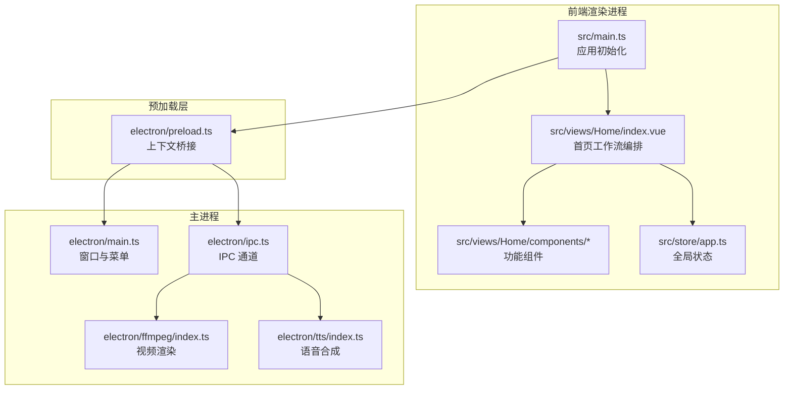
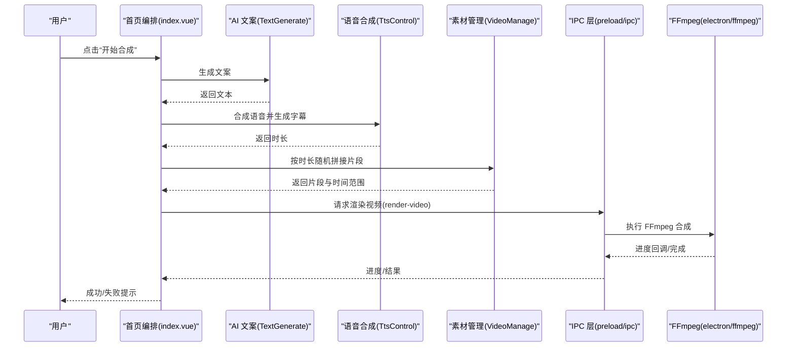
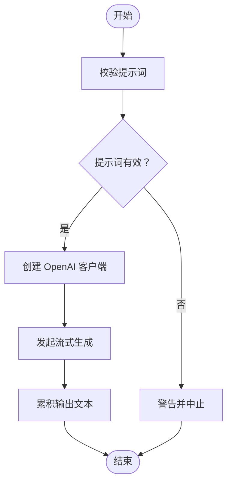
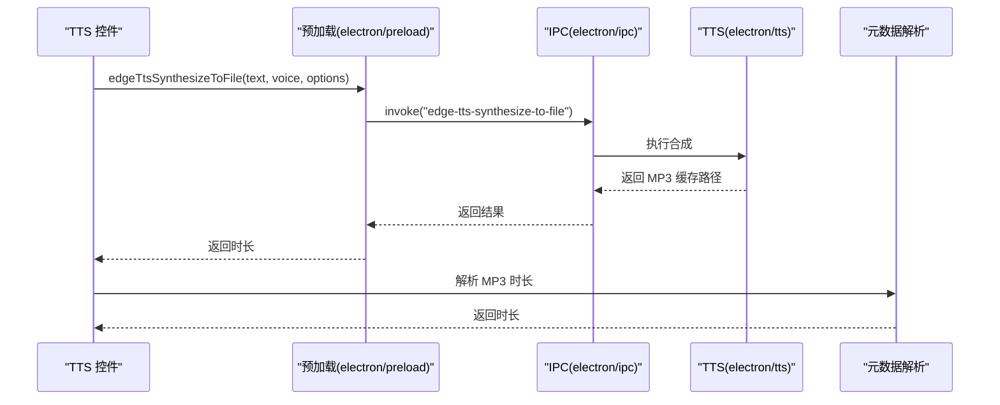
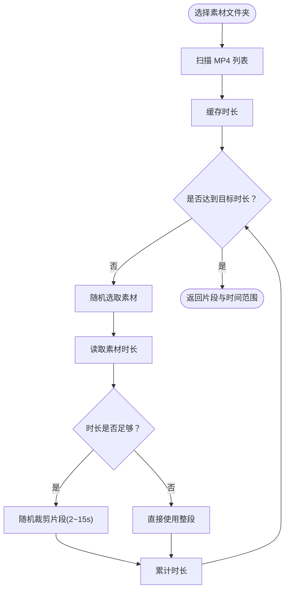
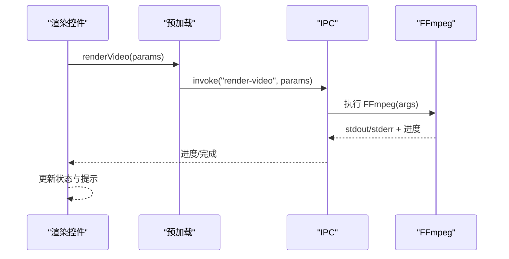
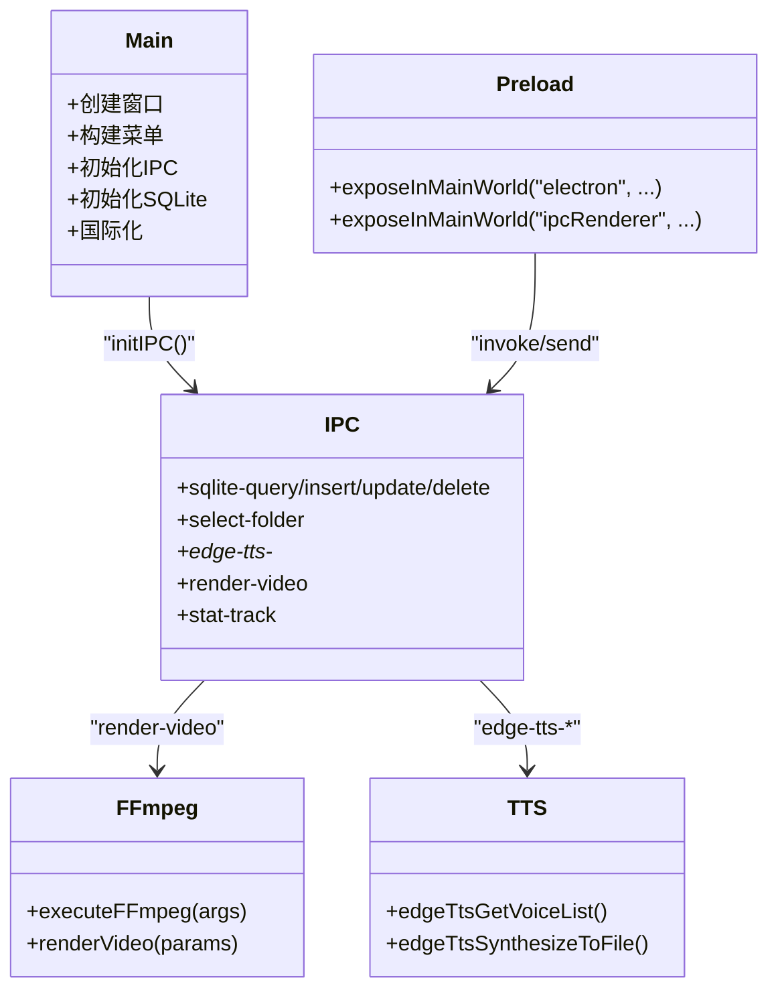
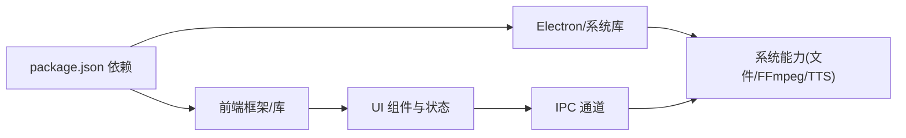

# 项目介绍

<cite>
**本文引用的文件**
- [README.md](file://README.md)
- [package.json](file://package.json)
- [src/main.ts](file://src/main.ts)
- [electron/main.ts](file://electron/main.ts)
- [electron/preload.ts](file://electron/preload.ts)
- [electron/ipc.ts](file://electron/ipc.ts)
- [electron/tts/index.ts](file://electron/tts/index.ts)
- [electron/ffmpeg/index.ts](file://electron/ffmpeg/index.ts)
- [src/views/Home/index.vue](file://src/views/Home/index.vue)
- [src/views/Home/components/TextGenerate.vue](file://src/views/Home/components/TextGenerate.vue)
- [src/views/Home/components/TtsControl.vue](file://src/views/Home/components/TtsControl.vue)
- [src/views/Home/components/VideoManage.vue](file://src/views/Home/components/VideoManage.vue)
- [src/views/Home/components/VideoRender.vue](file://src/views/Home/components/VideoRender.vue)
- [src/store/app.ts](file://src/store/app.ts)
- [locales/zh-CN/common.json](file://locales/zh-CN/common.json)
</cite>

## 目录
1. [引言](#引言)
2. [项目结构](#项目结构)
3. [核心组件](#核心组件)
4. [架构总览](#架构总览)
5. [详细组件分析](#详细组件分析)
6. [依赖关系分析](#依赖关系分析)
7. [性能考量](#性能考量)
8. [故障排查指南](#故障排查指南)
9. [结论](#结论)
10. [附录](#附录)

## 引言
短视频工厂是一个面向创作者与运营团队的桌面端 AI 驱动短视频自动化生产工具。项目通过“提示词 + 分镜素材”的极简输入，即可一键生成高质量的产品营销与泛内容短视频，覆盖从 AI 文案生成、语音合成、视频剪辑到字幕特效的全流程。其核心价值在于：
- 降低门槛：无需专业剪辑技能，只需准备分镜素材与提示词，即可批量产出视频。
- 提升效率：AI 辅助文案生成与自动剪辑，显著缩短创作周期。
- 增强一致性：统一的输出尺寸、配乐策略与字幕风格，便于品牌传播。
- 多平台可用：支持 Windows、macOS、Linux，开箱即用。

项目同时强调本地化运行与隐私安全，所有处理均在本地完成，保障素材与数据不出域。

## 项目结构
项目采用 Electron + Vue 3 的桌面端架构，前端负责交互与状态管理，后端（Electron 主进程）负责系统能力调用（文件系统、FFmpeg、TTS、统计上报等）。核心模块划分如下：
- 前端（src/）
  - 应用入口与 UI 框架初始化
  - 页面与功能组件（文案生成、素材管理、TTS 控制、渲染控制）
  - 状态管理（Pinia Store）
- 电子（electron/）
  - 主进程：窗口、菜单、IPC、SQLite、统计、FFmpeg、TTS 等
  - 预加载：安全桥接，向渲染进程暴露受控 API
- 本地资源与脚本
  - 本地 SQLite 扩展、FFmpeg 可执行文件、国际化资源等

**图表来源**
- [src/main.ts:1-62](file://src/main.ts#L1-L62)
- [electron/main.ts:1-204](file://electron/main.ts#L1-L204)
- [electron/preload.ts:1-75](file://electron/preload.ts#L1-L75)
- [electron/ipc.ts:1-188](file://electron/ipc.ts#L1-L188)
- [electron/ffmpeg/index.ts:1-272](file://electron/ffmpeg/index.ts#L1-L272)
- [electron/tts/index.ts:1-86](file://electron/tts/index.ts#L1-L86)

**章节来源**
- [src/main.ts:1-62](file://src/main.ts#L1-L62)
- [electron/main.ts:1-204](file://electron/main.ts#L1-L204)
- [electron/preload.ts:1-75](file://electron/preload.ts#L1-L75)
- [electron/ipc.ts:1-188](file://electron/ipc.ts#L1-L188)
- [electron/ffmpeg/index.ts:1-272](file://electron/ffmpeg/index.ts#L1-L272)
- [electron/tts/index.ts:1-86](file://electron/tts/index.ts#L1-L86)

## 核心组件
- 文案生成（TextGenerate）
  - 基于 OpenAI 标准接口的流式生成，支持配置模型、地址与密钥，并可在线测试连通性。
- TTS 控制（TtsControl）
  - 通过 EdgeTTS 获取语音列表，支持语言/性别/音色/语速选择与试听；可将文本合成至文件并生成字幕。
- 素材管理（VideoManage）
  - 选择分镜素材文件夹，扫描 MP4 文件，缓存时长，按目标时长随机拼接片段。
- 渲染控制（VideoRender）
  - 配置输出分辨率、文件名、导出目录、背景音乐目录；启动/取消渲染；显示进度与状态。
- 主页编排（Home/index）
  - 协调各阶段状态机，串联“生成文案 → 合成语音 → 选取片段 → 渲染视频”，并支持自动批量。

**章节来源**
- [src/views/Home/components/TextGenerate.vue:1-272](file://src/views/Home/components/TextGenerate.vue#L1-L272)
- [src/views/Home/components/TtsControl.vue:1-234](file://src/views/Home/components/TtsControl.vue#L1-L234)
- [src/views/Home/components/VideoManage.vue:1-308](file://src/views/Home/components/VideoManage.vue#L1-L308)
- [src/views/Home/components/VideoRender.vue:1-246](file://src/views/Home/components/VideoRender.vue#L1-L246)
- [src/views/Home/index.vue:1-244](file://src/views/Home/index.vue#L1-L244)
- [src/store/app.ts:1-114](file://src/store/app.ts#L1-L114)

## 架构总览
整体流程从用户输入提示词与素材开始，依次经过 AI 文案生成、TTS 语音合成、视频片段拼接与字幕叠加，最终由 FFmpeg 输出成品视频。主进程通过 IPC 将系统能力暴露给前端，同时负责窗口、菜单、统计与文件系统访问。

**图表来源**
- [src/views/Home/index.vue:65-212](file://src/views/Home/index.vue#L65-L212)
- [src/views/Home/components/TextGenerate.vue:132-193](file://src/views/Home/components/TextGenerate.vue#L132-L193)
- [src/views/Home/components/TtsControl.vue:209-228](file://src/views/Home/components/TtsControl.vue#L209-L228)
- [src/views/Home/components/VideoManage.vue:196-300](file://src/views/Home/components/VideoManage.vue#L196-L300)
- [electron/preload.ts:49-65](file://electron/preload.ts#L49-L65)
- [electron/ipc.ts:171-186](file://electron/ipc.ts#L171-L186)
- [electron/ffmpeg/index.ts:26-186](file://electron/ffmpeg/index.ts#L26-L186)

## 详细组件分析

### 文案生成（AI 驱动）
- 功能要点
  - 流式生成：使用 OpenAI 兼容接口进行流式文本生成，支持中断。
  - 配置与测试：可配置模型名、API 地址与密钥；内置连通性测试。
  - 错误处理：统一弹窗与错误详情复制能力，便于定位问题。
- 数据流
  - 输入提示词 → 创建 OpenAI 客户端 → 发起流式生成 → 累积输出文本 → 暴露给渲染流程。

**图表来源**
- [src/views/Home/components/TextGenerate.vue:132-193](file://src/views/Home/components/TextGenerate.vue#L132-L193)

**章节来源**
- [src/views/Home/components/TextGenerate.vue:1-272](file://src/views/Home/components/TextGenerate.vue#L1-L272)

### 语音合成（TTS）
- 功能要点
  - 语音列表：通过 EdgeTTS 获取可用音色，按语言/性别筛选。
  - 试听与合成：支持试听与将文本合成到文件，生成 SRT 字幕。
  - 元数据解析：解析 MP3 时长，确保后续拼接时长准确。
- 数据流
  - 选择音色/语速 → 调用主进程合成 → 写入临时文件 → 可选生成字幕 → 返回时长。

**图表来源**
- [electron/preload.ts:59-63](file://electron/preload.ts#L59-L63)
- [electron/ipc.ts:168-169](file://electron/ipc.ts#L168-L169)
- [electron/tts/index.ts:45-85](file://electron/tts/index.ts#L45-L85)

**章节来源**
- [src/views/Home/components/TtsControl.vue:1-234](file://src/views/Home/components/TtsControl.vue#L1-L234)
- [electron/tts/index.ts:1-86](file://electron/tts/index.ts#L1-L86)

### 素材管理（视频片段拼接）
- 功能要点
  - 选择素材文件夹 → 扫描 MP4 → 缓存时长 → 按目标时长随机拼接片段。
  - 片段长度限制在 2–15 秒之间，避免过短或过长影响节奏。
- 数据流
  - 用户选择文件夹 → 列表刷新 → 读取每段时长 → 随机抽取并裁剪 → 返回片段与时间范围。

**图表来源**
- [src/views/Home/components/VideoManage.vue:94-144](file://src/views/Home/components/VideoManage.vue#L94-L144)
- [src/views/Home/components/VideoManage.vue:196-300](file://src/views/Home/components/VideoManage.vue#L196-L300)

**章节来源**
- [src/views/Home/components/VideoManage.vue:1-308](file://src/views/Home/components/VideoManage.vue#L1-L308)

### 渲染控制（视频合成）
- 功能要点
  - 配置输出分辨率、文件名、导出目录、背景音乐目录。
  - 启动渲染：调用主进程执行 FFmpeg，实时进度回传。
  - 取消渲染：通过 AbortController 中断子进程。
- 数据流
  - 用户点击开始 → 校验配置 → 调用渲染 → 进度回调 → 成功/失败提示。

**图表来源**
- [src/views/Home/components/VideoRender.vue:196-199](file://src/views/Home/components/VideoRender.vue#L196-L199)
- [electron/preload.ts:63](file://electron/preload.ts#L63)
- [electron/ipc.ts:171-186](file://electron/ipc.ts#L171-L186)
- [electron/ffmpeg/index.ts:188-244](file://electron/ffmpeg/index.ts#L188-L244)

**章节来源**
- [src/views/Home/components/VideoRender.vue:1-246](file://src/views/Home/components/VideoRender.vue#L1-L246)

### 主进程与 IPC
- 主进程职责
  - 窗口与菜单、国际化、SQLite、统计上报、文件系统、FFmpeg、TTS。
- IPC 暴露能力
  - 文件夹选择、文件列表、语音合成、渲染视频、统计事件等。
- 预加载桥接
  - 通过 contextBridge 将受限 API 暴露给渲染进程，保证安全。

**图表来源**
- [electron/main.ts:187-204](file://electron/main.ts#L187-L204)
- [electron/preload.ts:18-75](file://electron/preload.ts#L18-L75)
- [electron/ipc.ts:77-187](file://electron/ipc.ts#L77-L187)
- [electron/ffmpeg/index.ts:188-244](file://electron/ffmpeg/index.ts#L188-L244)
- [electron/tts/index.ts:35-85](file://electron/tts/index.ts#L35-L85)

**章节来源**
- [electron/main.ts:1-204](file://electron/main.ts#L1-L204)
- [electron/preload.ts:1-75](file://electron/preload.ts#L1-L75)
- [electron/ipc.ts:1-188](file://electron/ipc.ts#L1-L188)

## 依赖关系分析
- 前端依赖
  - Vue 3、Vite、Pinia、Vue Router、Vuetify、i18n、Toast 等。
- 电子与系统依赖
  - Electron、FFmpeg（静态二进制）、better-sqlite3、music-metadata、subtitle 等。
- 关键耦合点
  - 渲染流程通过 IPC 串接 TTS 与 FFmpeg，状态通过 Pinia 管理，UI 通过 i18n 支持多语言。

**图表来源**
- [package.json:22-63](file://package.json#L22-L63)

**章节来源**
- [package.json:1-85](file://package.json#L1-L85)

## 性能考量
- 并行与异步
  - 文案生成采用流式接口，边生成边输出；TTS 合成与素材时长读取采用异步缓存，减少重复 IO。
- 资源复用
  - 素材时长缓存、语音临时文件复用、字幕文件生成，降低重复计算与磁盘写入。
- 渲染优化
  - FFmpeg 使用响度归一化与混合策略，保证音量均衡；按目标时长 trim 避免多余处理。
- 可中断与可取消
  - 通过 AbortController 支持取消渲染，避免长时间阻塞。

[本节为通用性能建议，不直接分析具体文件，故不附“章节来源”]

## 故障排查指南
- 常见问题与定位
  - 文案生成失败：检查提示词、模型名、API 地址与密钥；使用“测试连接”验证。
  - TTS 合成失败：检查网络、语音配置与临时文件权限；查看时长解析错误。
  - 素材不足：确认所选文件夹包含 MP4 且总时长足够；刷新素材库。
  - 渲染失败：检查输出路径、分辨率、背景音乐路径；查看 FFmpeg 进程日志。
- 用户反馈
  - 组件内提供“复制错误详情”能力，便于快速反馈与定位。

**章节来源**
- [src/views/Home/components/TextGenerate.vue:160-193](file://src/views/Home/components/TextGenerate.vue#L160-L193)
- [src/views/Home/components/TtsControl.vue:112-138](file://src/views/Home/components/TtsControl.vue#L112-L138)
- [src/views/Home/components/VideoManage.vue:118-141](file://src/views/Home/components/VideoManage.vue#L118-L141)
- [src/views/Home/index.vue:188-211](file://src/views/Home/index.vue#L188-L211)
- [locales/zh-CN/common.json:88-176](file://locales/zh-CN/common.json#L88-L176)

## 结论
短视频工厂以“AI 驱动 + 自动化剪辑”为核心，将原本需要多人协作与长时间打磨的短视频制作，简化为“提示词 + 分镜素材”的一键生成流程。项目在易用性、效率与一致性方面具备明显优势，适合内容创作者、电商运营与品牌传播团队快速落地短视频内容生产。

[本节为总结性内容，不直接分析具体文件，故不附“章节来源”]

## 附录

### 应用场景
- 产品营销短视频：通过提示词生成卖点文案，搭配产品分镜素材与配音，快速产出带货视频。
- 泛内容短视频：如知识类、情感类、生活类内容，借助 AI 文案与分镜素材，实现高效批量生产。

### 相比传统视频编辑软件的优势
- AI 辅助：提示词驱动的文案生成，降低创意门槛。
- 批量处理：支持自动批量合成，提高产出效率。
- 多平台支持：Windows/macOS/Linux 三端一致体验。
- 本地化安全：全程本地运行，保护素材与隐私。

**章节来源**
- [README.md:46-61](file://README.md#L46-L61)