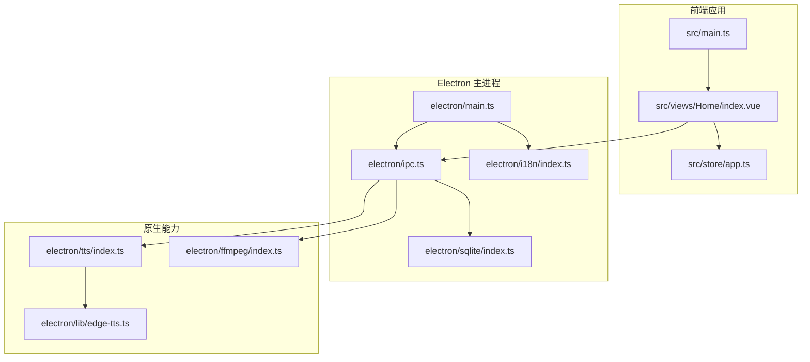
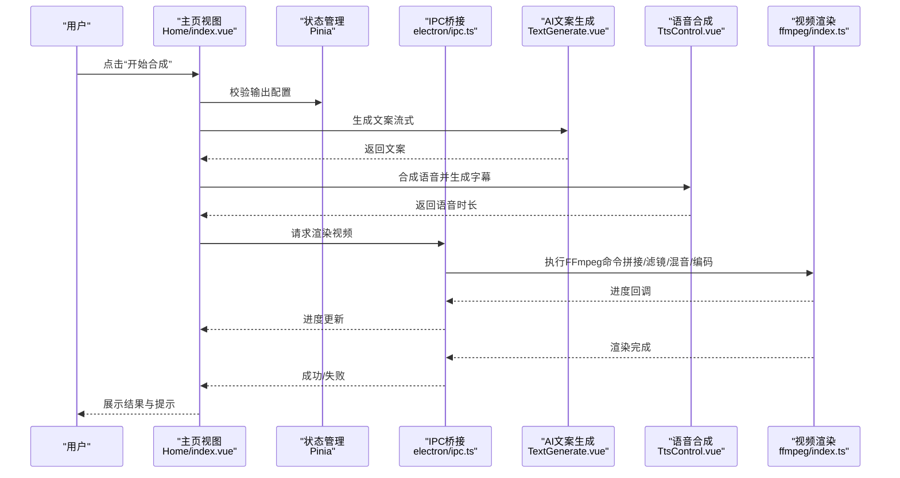
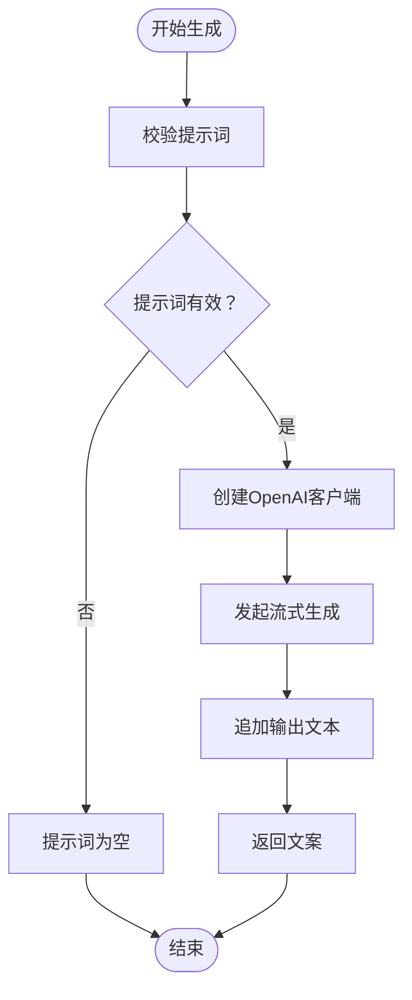
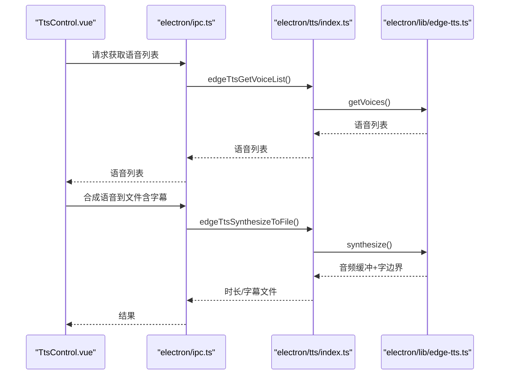
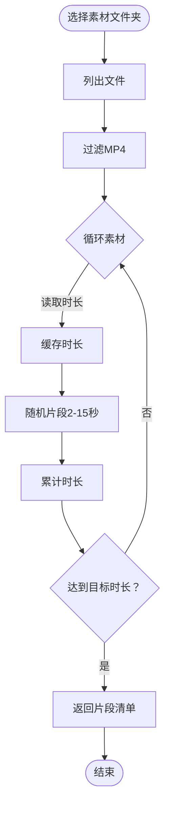
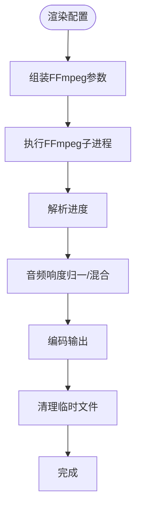
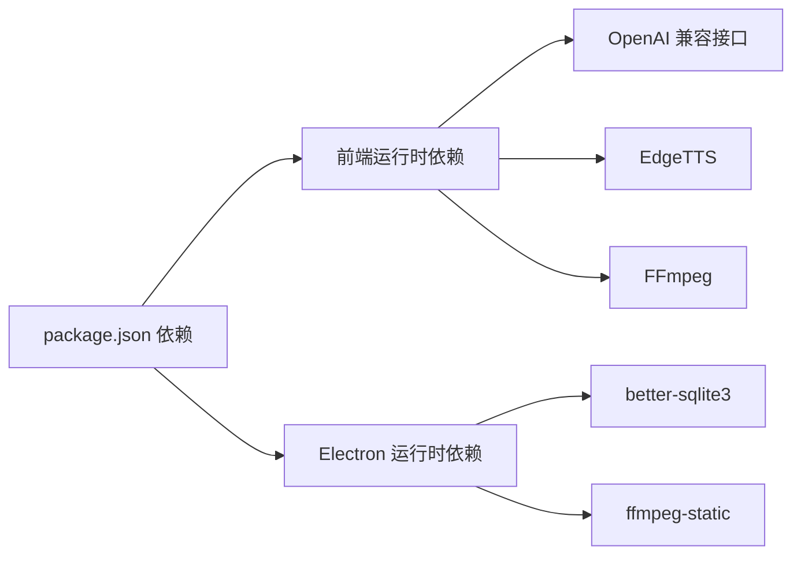

# 项目概述

<cite>
**本文引用的文件**
- [README.md](file://README.md)
- [package.json](file://package.json)
- [src/main.ts](file://src/main.ts)
- [electron/main.ts](file://electron/main.ts)
- [src/views/Home/index.vue](file://src/views/Home/index.vue)
- [src/views/Home/components/TextGenerate.vue](file://src/views/Home/components/TextGenerate.vue)
- [src/views/Home/components/TtsControl.vue](file://src/views/Home/components/TtsControl.vue)
- [src/views/Home/components/VideoManage.vue](file://src/views/Home/components/VideoManage.vue)
- [src/views/Home/components/VideoRender.vue](file://src/views/Home/components/VideoRender.vue)
- [src/store/app.ts](file://src/store/app.ts)
- [electron/ipc.ts](file://electron/ipc.ts)
- [electron/tts/index.ts](file://electron/tts/index.ts)
- [electron/ffmpeg/index.ts](file://electron/ffmpeg/index.ts)
- [electron/sqlite/index.ts](file://electron/sqlite/index.ts)
- [electron/lib/edge-tts.ts](file://electron/lib/edge-tts.ts)
- [electron/i18n/index.ts](file://electron/i18n/index.ts)
- [locales/zh-CN/common.json](file://locales/zh-CN/common.json)
</cite>

## 目录
1. [引言](#引言)
2. [项目结构](#项目结构)
3. [核心组件](#核心组件)
4. [架构总览](#架构总览)
5. [详细组件分析](#详细组件分析)
6. [依赖关系分析](#依赖关系分析)
7. [性能考量](#性能考量)
8. [故障排查指南](#故障排查指南)
9. [结论](#结论)
10. [附录](#附录)

## 引言
短视频工厂是一个面向产品营销与泛内容短视频制作的跨平台桌面应用，通过AI驱动的自动化流程，将“提示词文本 + 分镜素材”一键转化为高质量视频。项目集成AI文案生成、语音合成（EdgeTTS）、视频剪辑与字幕合成、批量处理与多语言支持，提供开箱即用的本地化解决方案，适合个人创作者、内容团队与企业营销场景。

## 项目结构
项目采用前端框架 + Electron 主进程 + 原生能力封装的分层架构：
- 前端层：Vue 3 + Vite，UI 使用 Vuetify，状态管理使用 Pinia，路由使用 Vue Router。
- 主进程层：Electron 主进程负责窗口、菜单、IPC、国际化、SQLite 数据库初始化与原生能力桥接。
- 原生能力层：封装 EdgeTTS 语音合成、FFmpeg 视频渲染、SQLite 数据访问、统计上报等。

图表来源
- [src/main.ts:1-62](file://src/main.ts#L1-L62)
- [electron/main.ts:1-204](file://electron/main.ts#L1-L204)
- [electron/ipc.ts:1-188](file://electron/ipc.ts#L1-L188)
- [electron/tts/index.ts:1-86](file://electron/tts/index.ts#L1-L86)
- [electron/ffmpeg/index.ts:1-272](file://electron/ffmpeg/index.ts#L1-L272)
- [electron/sqlite/index.ts:1-154](file://electron/sqlite/index.ts#L1-L154)
- [electron/lib/edge-tts.ts:1-632](file://electron/lib/edge-tts.ts#L1-L632)

章节来源
- [src/main.ts:1-62](file://src/main.ts#L1-L62)
- [electron/main.ts:1-204](file://electron/main.ts#L1-L204)
- [package.json:1-85](file://package.json#L1-L85)

## 核心组件
- 文案生成（LLM）
  - 基于 OpenAI 标准接口，使用流式生成与可中断控制，支持配置校验与连通性测试。
- 语音合成（EdgeTTS）
  - 支持多语言、多性别、多语速的语音列表获取与试听；可将合成结果保存为文件并生成字幕。
- 视频素材管理
  - 自动扫描指定文件夹内的 MP4 素材，缓存元数据，按目标时长随机拼接分镜片段。
- 视频渲染（FFmpeg）
  - 将视频片段、语音、背景音乐进行滤镜拼接、响度归一化、字幕叠加、编码输出。
- 应用状态与配置
  - 使用 Pinia 管理渲染状态、TTS 参数、渲染配置与自动批量开关，并持久化非敏感配置。
- 国际化与菜单
  - Electron 主进程初始化 i18n，提供菜单语言切换与窗口控制。

章节来源
- [src/views/Home/components/TextGenerate.vue:1-272](file://src/views/Home/components/TextGenerate.vue#L1-L272)
- [src/views/Home/components/TtsControl.vue:1-234](file://src/views/Home/components/TtsControl.vue#L1-L234)
- [src/views/Home/components/VideoManage.vue:1-308](file://src/views/Home/components/VideoManage.vue#L1-L308)
- [src/views/Home/components/VideoRender.vue:1-246](file://src/views/Home/components/VideoRender.vue#L1-L246)
- [src/store/app.ts:1-114](file://src/store/app.ts#L1-L114)
- [electron/tts/index.ts:1-86](file://electron/tts/index.ts#L1-L86)
- [electron/ffmpeg/index.ts:1-272](file://electron/ffmpeg/index.ts#L1-L272)
- [electron/sqlite/index.ts:1-154](file://electron/sqlite/index.ts#L1-L154)
- [electron/i18n/index.ts:1-43](file://electron/i18n/index.ts#L1-L43)

## 架构总览
整体流程从“提示词 + 分镜素材”出发，依次完成文案生成、语音合成、素材拼接与视频渲染，期间通过 IPC 与主进程交互，最终输出成品视频。

图表来源
- [src/views/Home/index.vue:65-212](file://src/views/Home/index.vue#L65-L212)
- [src/views/Home/components/TextGenerate.vue:132-193](file://src/views/Home/components/TextGenerate.vue#L132-L193)
- [src/views/Home/components/TtsControl.vue:209-228](file://src/views/Home/components/TtsControl.vue#L209-L228)
- [electron/ipc.ts:171-186](file://electron/ipc.ts#L171-L186)
- [electron/ffmpeg/index.ts:26-186](file://electron/ffmpeg/index.ts#L26-L186)

## 详细组件分析

### 文案生成（TextGenerate）
- 功能要点
  - 输入提示词，调用 OpenAI 兼容接口进行流式生成。
  - 支持中止生成、配置对话框、连通性测试与错误弹窗。
- 关键流程
  - 校验提示词 → 创建 OpenAI 客户端 → 发起流式请求 → 实时拼接输出 → 错误捕获与复制详情。

图表来源
- [src/views/Home/components/TextGenerate.vue:132-193](file://src/views/Home/components/TextGenerate.vue#L132-L193)

章节来源
- [src/views/Home/components/TextGenerate.vue:1-272](file://src/views/Home/components/TextGenerate.vue#L1-L272)

### 语音合成（TtsControl）
- 功能要点
  - 选择语言/性别/声音，试听与保存语音，生成对应字幕文件。
  - 与 EdgeTTS 通信，支持速率调节与错误处理。
- 关键流程
  - 选择参数 → 校验参数 → 调用主进程 → 合成到文件/试听 → 生成字幕SRT → 返回时长。

图表来源
- [src/views/Home/components/TtsControl.vue:165-199](file://src/views/Home/components/TtsControl.vue#L165-L199)
- [electron/ipc.ts:157-169](file://electron/ipc.ts#L157-L169)
- [electron/tts/index.ts:35-85](file://electron/tts/index.ts#L35-L85)
- [electron/lib/edge-tts.ts:420-632](file://electron/lib/edge-tts.ts#L420-L632)

章节来源
- [src/views/Home/components/TtsControl.vue:1-234](file://src/views/Home/components/TtsControl.vue#L1-L234)
- [electron/tts/index.ts:1-86](file://electron/tts/index.ts#L1-L86)
- [electron/lib/edge-tts.ts:1-632](file://electron/lib/edge-tts.ts#L1-L632)

### 视频素材管理（VideoManage）
- 功能要点
  - 选择素材文件夹 → 列出MP4 → 缓存时长 → 随机拼接片段至目标时长。
- 关键流程
  - 选择文件夹 → 读取文件 → 过滤MP4 → 逐个读取时长 → 随机截取片段 → 汇总输出。

图表来源
- [src/views/Home/components/VideoManage.vue:94-300](file://src/views/Home/components/VideoManage.vue#L94-L300)

章节来源
- [src/views/Home/components/VideoManage.vue:1-308](file://src/views/Home/components/VideoManage.vue#L1-L308)

### 视频渲染（VideoRender + FFmpeg）
- 功能要点
  - 配置输出尺寸/文件名/路径/BGM → 调用主进程渲染 → 进度回调 → 成功/失败提示。
- 关键流程
  - 组装参数 → 拼接视频流/滤镜链 → 响度归一化/混合音频 → 编码输出 → 清理临时文件。

图表来源
- [src/views/Home/components/VideoRender.vue:188-241](file://src/views/Home/components/VideoRender.vue#L188-L241)
- [electron/ffmpeg/index.ts:26-272](file://electron/ffmpeg/index.ts#L26-L272)

章节来源
- [src/views/Home/components/VideoRender.vue:1-246](file://src/views/Home/components/VideoRender.vue#L1-L246)
- [electron/ffmpeg/index.ts:1-272](file://electron/ffmpeg/index.ts#L1-L272)

### 应用状态与配置（Pinia Store）
- 功能要点
  - 管理渲染状态枚举、LLM配置、TTS参数、渲染配置、自动批量开关与国际化区域。
- 关键状态
  - RenderStatus：空闲/生成文案/语音合成/分镜处理/渲染中/完成/失败。
  - persist：仅持久化必要配置，避免敏感信息泄露。

章节来源
- [src/store/app.ts:1-114](file://src/store/app.ts#L1-L114)

### 主进程与IPC（Electron）
- 功能要点
  - 初始化窗口、菜单、国际化、SQLite；提供IPC接口：选择文件夹、列举文件、EdgeTTS、渲染视频、统计上报。
- 关键职责
  - 与渲染进程通信，转发原生能力调用，维护跨进程状态与事件。

章节来源
- [electron/main.ts:1-204](file://electron/main.ts#L1-L204)
- [electron/ipc.ts:1-188](file://electron/ipc.ts#L1-L188)

### 数据存储（SQLite）
- 功能要点
  - 基于 better-sqlite3 的封装，提供查询/插入/更新/删除/批量插入或更新。
- 部署细节
  - 根据平台与架构选择原生绑定文件，数据库位于 userData 目录。

章节来源
- [electron/sqlite/index.ts:1-154](file://electron/sqlite/index.ts#L1-L154)

### 国际化（i18n）
- 功能要点
  - Electron 主进程加载本地化资源，提供语言切换与菜单语言同步。

章节来源
- [electron/i18n/index.ts:1-43](file://electron/i18n/index.ts#L1-L43)
- [locales/zh-CN/common.json:1-178](file://locales/zh-CN/common.json#L1-L178)

## 依赖关系分析
- 前端依赖
  - Vue 3、Vuetify、Pinia、Vue Router、i18next、axios、ws、subtitle、music-metadata 等。
- Electron 依赖
  - better-sqlite3、ffmpeg-static、i18next-fs-backend、electron-builder 等。
- 关键外部服务
  - OpenAI 兼容接口（LLM）、微软 EdgeTTS（语音合成）、FFmpeg（视频处理）。

图表来源
- [package.json:22-63](file://package.json#L22-L63)

章节来源
- [package.json:1-85](file://package.json#L1-L85)

## 性能考量
- 文案生成
  - 使用流式接口减少等待时间；支持中止，避免长时间阻塞。
- 语音合成
  - 边界分割文本，避免超长文本导致的网络/协议限制；生成字幕SRT便于后续字幕叠加。
- 视频渲染
  - 使用响度归一化与混合策略保证音量一致性；按目标时长裁剪音频避免尾部噪声。
- 文件系统
  - 缓存素材时长，降低重复读取成本；唯一文件名避免覆盖冲突。
- 跨平台
  - FFmpeg 可执行文件在打包后解压路径下运行，Windows 平台进行可执行权限校验。

## 故障排查指南
- 文案生成失败
  - 检查提示词是否为空；确认 OpenAI 接口地址与密钥；使用“测试配置”验证连通性；复制错误详情便于定位。
- 语音合成失败
  - 确认已选择声音；检查网络连通；查看“试听”是否可用；若时长为0或文件损坏，检查TTS配置与网络。
- 素材读取失败
  - 确认所选文件夹存在且包含MP4；刷新素材库；检查文件权限。
- 渲染失败
  - 检查输出路径、分辨率、文件名与扩展名；确认BGM文件夹存在且包含MP3；查看进度与日志；必要时手动清理临时文件。
- 国际化/菜单语言
  - 通过主进程切换语言，确保菜单与界面同步更新。

章节来源
- [src/views/Home/components/TextGenerate.vue:160-193](file://src/views/Home/components/TextGenerate.vue#L160-L193)
- [src/views/Home/components/TtsControl.vue:112-138](file://src/views/Home/components/TtsControl.vue#L112-L138)
- [src/views/Home/components/VideoManage.vue:118-141](file://src/views/Home/components/VideoManage.vue#L118-L141)
- [src/views/Home/components/VideoRender.vue:196-241](file://src/views/Home/components/VideoRender.vue#L196-L241)
- [electron/i18n/index.ts:37-43](file://electron/i18n/index.ts#L37-L43)

## 结论
短视频工厂以“AI + 原生能力”的组合，实现了从文案到语音再到视频的一体化自动化流程。其跨平台桌面形态、本地化运行与开箱即用的设计，使其在产品营销与泛内容短视频制作领域具备显著的应用价值。未来可进一步扩展参数调整、更多语音API与字幕特效，持续提升易用性与创意表达能力。

## 附录
- 项目背景与路线图
  - 项目目标：通过AI技术简化短视频制作流程，提供高颜值、多语言、跨平台的桌面端工具。
  - 已实现：文案生成（OpenAI兼容）、语音合成（EdgeTTS）、视频剪辑与字幕合成、批量处理、多语言支持、使用手册。
  - 待完善：更全面的参数调整、更多语音API、字幕特效样式。
- 示例视频
  - 项目README中提供了产品营销与治愈系语录两类示例视频，展示剪辑效果与素材来源说明。

章节来源
- [README.md:44-112](file://README.md#L44-L112)
- [README.md:73-91](file://README.md#L73-L91)